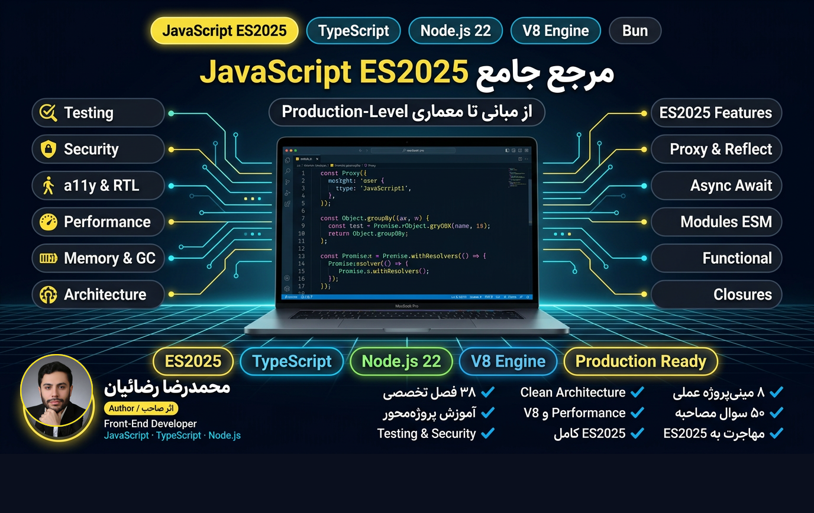
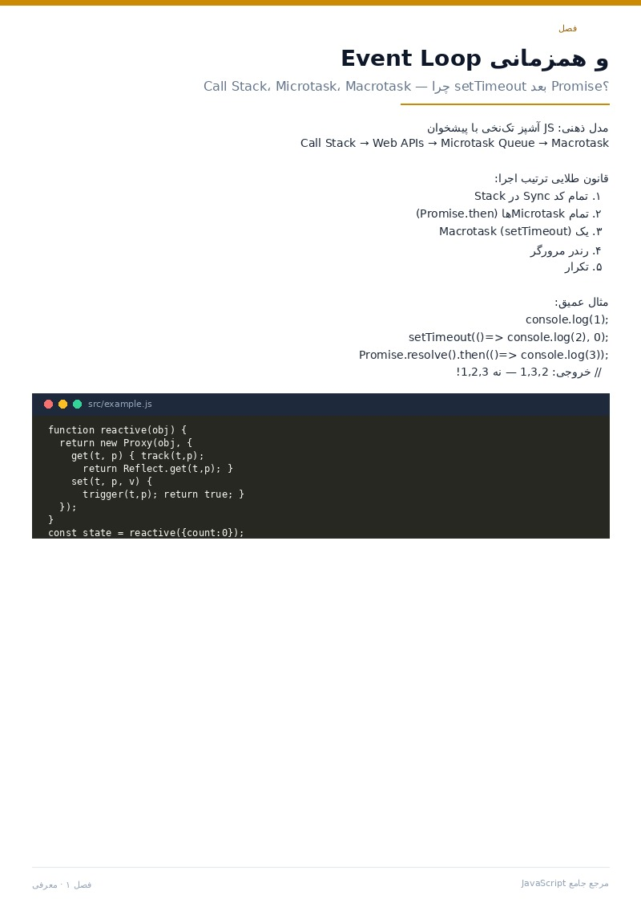
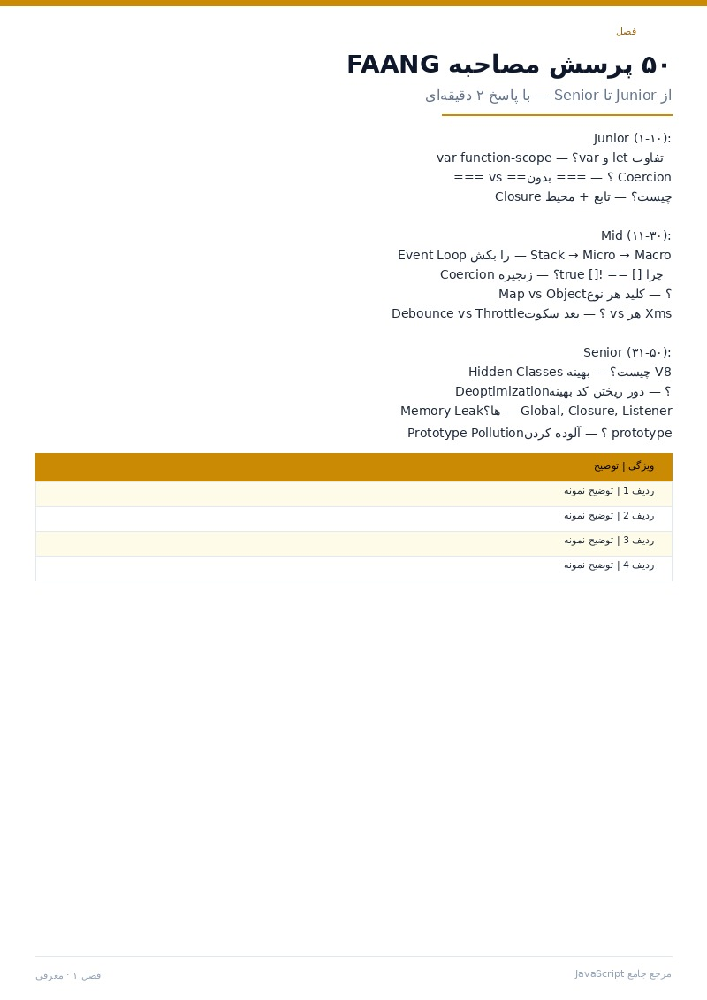

<a id="top"></a>

<div align="center">



</div>

<div dir="rtl" align="center">

# 📘 مرجع جامع JavaScript ES2025

**از مبانی تا معماری Production-Level** — کامل‌ترین مرجع فارسی JavaScript مدرن، پروژه‌محور و بر پایه مدل ذهنی درست.

<sub>ویرایش ۱.۰.۰ · ۲۰۲۶ · نویسنده: محمدرضا رضائیان</sub>

</div>

<div dir="ltr" align="center">


<br>

[](./docs/pdf/JavaScript-Persian-Guide.pdf)
[](./docs/pdf/JavaScript-Persian-Guide.epub)
[](https://rezaian-dev.github.io/javascript-persian-guide/)
[](https://github.com/rezaian-dev/javascript-persian-guide)

</div>

---

<div dir="rtl">

| | |
|:--|:--|
| [📖 چرا این مرجع؟](#why) | [📚 فصل‌ها](#parts) |
| [📌 کتاب در یک نگاه](#amar) | [📥 دانلود](#download) |
| [🎯 برای چه کسی است؟](#for-whom) | [🛠️ ساخت از سورس](#build) |
| [🗺️ مسیرهای خواندن](#paths) | [👀 پیش‌نمایش](#preview) |
| [👤 نویسنده](#author) | [📄 مجوز](#license) |

</div>

---

<div dir="rtl">

<a id="why"></a>

## ✨ چرا این مرجع؟

### 🧠 مدل ذهنی، نه حفظ API

هر فصل با «چرا» شروع می‌شود: Closure چیست، Event Loop چگونه کار می‌کند، چرا `this` گم می‌شود و چرا `[] == ![]` true است. بعد از این کتاب می‌توانید پیش‌بینی کنید JS چه کار می‌کند — نه حدس بزنید.

### ⚡ به‌روز با ES2025 و V8

همه قابلیت‌های مدرن پوشش داده شده: `Object.groupBy`، `Promise.withResolvers`، `Array.fromAsync`، Import Attributes، Decorators، `using`، Set Methods، `structuredClone`، `AbortSignal.timeout` — هرچه پایدار است آموزش داده می‌شود و Legacy با برچسب مشخص شده.

### 🔬 ۲۰ اشتباه رایج، کالبدشکافی‌شده

در ۲۰ جعبه «اشتباه رایج»: کد غلط، دلیل درست فکر کردن، و نسخه صحیح کنار هم. دقیقاً همان چیزهایی که در Code Review گرفته می‌شوند.

### 🚀 پلی تا Production

معماری Clean، تست با Vitest و Playwright، امنیت و CSP، XSS، Prototype Pollution، Web Vitals، Performance و V8 Internals؛ در انتها ۵۰ پرسش مصاحبه FAANG از Junior تا Senior.

</div>

---

<div dir="rtl">

<a id="amar"></a>

## 📌 کتاب در یک نگاه — آمار واقعی

| شاخص | مقدار واقعی | شاخص | مقدار واقعی |
|:--|:--:|:--|:--:|
| فصل در ۴ بخش | ۳۸ | نکته طلایی | ۳۰ |
| صفحه A4 رنگی | ۱۵۶ | اشتباه رایج با راه‌حل | ۲۰ |
| مینی‌پروژه در کارگاه | ۸ | مدخل واژه‌نامه | ۱۴۰+ |
| پرسش مصاحبه | ۵۰ | نسخه منتشرشده | ۱.۰.۰ |
| حجم PDF | ۲.۲MB | حجم EPUB | ۲۰۴KB |

</div>

---

<div dir="rtl">

<a id="for-whom"></a>

## 🎯 برای چه کسی است؟

| ✅ مناسب شماست اگر… | ⚠️ فعلاً نروید سراغش اگر… |
|:--|:--|
| با HTML/CSS آشنایید و می‌خواهید JS را عمیق و از پایه یاد بگیرید | تازه با متغیر آشنا شده‌اید؛ از فصل ۱ شروع کنید |
| کد می‌نویسید ولی «چرا this گم شد؟» برایتان جعبه سیاه است | فقط یک اسنیپت آماده می‌خواهید؛ این کتاب تفکر می‌دهد |
| می‌خواهید Event Loop، Closure، Proxy و Performance را بفهمید | با فریم‌ورک کار می‌کنید ولی JS پایه را نخوانده‌اید؛ اول این کتاب |
| برای مصاحبه FAANG آماده می‌شوید یا Code Review تیم را جدی‌تر می‌کنید |  |

</div>

---

<div dir="rtl">

<a id="parts"></a>

## 📚 فهرست کتاب — ۳۸ فصل در ۴ بخش

### بخش ۱: بنیادها و مدل ذهنی (۱ تا ۱۲)
معرفی، محیط توسعه، انواع داده، متغیرها و Scope، عملگرها، توابع، Closure، اشیا و Prototype، آرایه‌ها، رشته و Regex، this، مقدمه Async

### بخش ۲: جاوااسکریپت مدرن و عمیق (۱۳ تا ۲۴)
Destructuring، Iterator و Generator، Promise پیشرفته، Event Loop، ماژول‌ها ESM/CJS، کلاس‌ها و OOP، مدیریت خطا، Map/Set، Proxy و Reflect، Functional Programming، DOM و BOM، Fetch و Storage

### بخش ۳: پیشرفته، معماری و Production (۲۵ تا ۳۲)
Performance و V8، Memory و GC، امنیت، تست‌نویسی Vitest، ابزارها و Bundlerها، TypeScript، الگوها و معماری تمیز، متاپروگرامینگ

### بخش ۴: کارگاه، نکات طلایی و مصاحبه (۳۳ تا ۳۸)
۳۰ نکته طلایی، کارگاه ۸ پروژه، ۲۰ اشتباه رایج، ۵۰ پرسش مصاحبه، واژه‌نامه ۱۴۰ اصطلاح، نقشه راه

</div>

---

<div dir="rtl">

<a id="paths"></a>

## 🗺️ مسیرهای خواندن

| مسیر | فصل‌ها | چه چیزی می‌گیرید |
|:--|:--|:--|
| **مبتدی تا متوسط** | ۱ تا ۱۲ | مدل ذهنی، انواع داده، Scope، Closure، this، Prototype، Promise |
| **سطح پیشرفته** | ۱۳ تا ۲۴ | ESM، Generator، Event Loop، Proxy، FP، DOM، Fetch |
| **Production** | ۲۵ تا ۳۲ | Performance، GC، Security، Test، Tooling، TS، Architecture |
| **کارگاه و مصاحبه** | ۳۳ تا ۳۸ | ۳۰ نکته، ۸ پروژه، ۲۰ اشتباه، ۵۰ پرسش، واژه‌نامه |

</div>

---

<div dir="rtl">

<a id="preview"></a>

## 👀 پیش‌نمایش صفحات

</div>

<div align="center">


<br><br>







</div>

---

<div dir="rtl">

<a id="download"></a>

## 📥 دانلود — نسخه‌های واقعی

| نسخه | لینک | توضیح واقعی |
|:--|:--|:--|
| **PDF رنگی** | [JavaScript-Persian-Guide.pdf](./docs/pdf/JavaScript-Persian-Guide.pdf) | ۱۵۶ صفحه، ۲.۲MB، کامل، رنگی، مناسب مطالعه دیجیتال |
| **EPUB** | [JavaScript-Persian-Guide.epub](./docs/pdf/JavaScript-Persian-Guide.epub) | ۳۸ فصل، ۲۰۴KB، مناسب موبایل و کتابخوان |
| **وب‌سایت معرفی** | [Live Site](https://rezaian-dev.github.io/javascript-persian-guide/) | پیش‌نمایش صفحات با کیفیت بالا، دانلود مستقیم، کاملاً ریسپانسیو از 320px |

</div>

---

<div dir="rtl">

<a id="build"></a>

## 🛠️ ساخت از سورس

```bash
cd src
pip install -r requirements.txt
python build.py --html   # فقط HTML برای پیش‌نمایش سریع
python build.py          # PDF رنگی اصلی
python build.py --print  # نسخه سیاه‌سفید برای چاپ
```

خروجی:
- `docs/pdf/JavaScript-Persian-Guide.pdf`
- `src/build/book.html` (موقت، gitignore)

نیازمندی‌ها: Python 3.10+، WeasyPrint، Vazirmatn و JetBrains Mono (در `src/fonts/` موجود است)

</div>

---

<div dir="rtl">

<a id="author"></a>

## 👤 نویسنده

</div>

<div dir="rtl" style="display:flex; gap:20px; align-items:center; background:#f8fafc; border:1px solid #e2e8f0; border-radius:16px; padding:20px; flex-wrap:wrap;">


<div style="flex:1; min-width:240px;">

### محمدرضا رضائیان — Mohammadreza Rezaian

**Front-End Developer · JavaScript ES2025 · TypeScript · Node.js · V8 · Performance · Architecture**

گردآوری و تدوین این مرجع با هدف ارتقای سطح دانش عمیق JavaScript در جامعه فارسی‌زبان انجام شده — با الگوبرداری از بهترین مراجع جهانی و تمرکز بر مدل ذهنی درست، یادگیری فعال و آمادگی کامل برای بازار کار Production-Level.

<div style="margin-top:10px; display:flex; gap:8px; flex-wrap:wrap;">
<span style="font-family:monospace; font-size:11px; padding:4px 10px; border-radius:999px; background:#fefce8; border:1px solid #fde68a; color:#854d0e;">ES2025 Expert</span>
<span style="font-family:monospace; font-size:11px; padding:4px 10px; border-radius:999px; background:#f0f9ff; border:1px solid #bae6fd; color:#0c4a6e;">V8 Internals</span>
<span style="font-family:monospace; font-size:11px; padding:4px 10px; border-radius:999px; background:#f0fdf4; border:1px solid #bbf7d0; color:#14532d;">Performance</span>
<span style="font-family:monospace; font-size:11px; padding:4px 10px; border-radius:999px; background:#faf5ff; border:1px solid #e9d5ff; color:#581c87;">Clean Architecture</span>
</div>

</div>

<div style="display:flex; gap:10px; flex-wrap:wrap;">

[](https://github.com/rezaian-dev)
[](https://github.com/rezaian-dev/react-19-persian-guide)
[](https://rezaian-dev.github.io/javascript-persian-guide/)

</div>

</div>

---

<div dir="rtl">

<a id="license"></a>

## 📄 مجوز

این اثر تحت مجوز **CC BY-NC-SA 4.0** منتشر شده — استفاده غیرتجاری با ذکر منبع آزاد است.

- ✅ اشتراک‌گذاری و اقتباس با ذکر نویسنده
- ❌ استفاده تجاری بدون اجازه
- 🔁 انتشار اقتباس با همین مجوز

</div>

---

<div dir="rtl" align="center">

**کدنویسی خوش!** 🚀💛

```js
console.log("JavaScript is love — when you understand it deeply");
```

[⬆️ بازگشت به بالا](#top)

</div>
