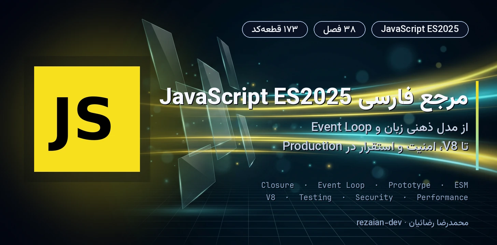
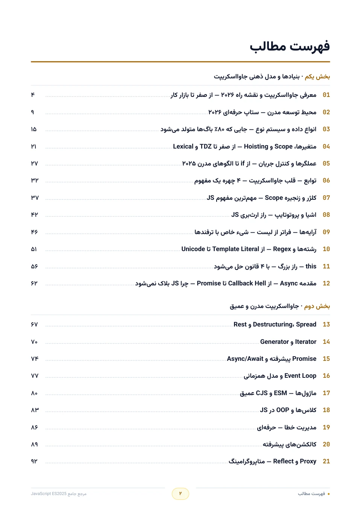
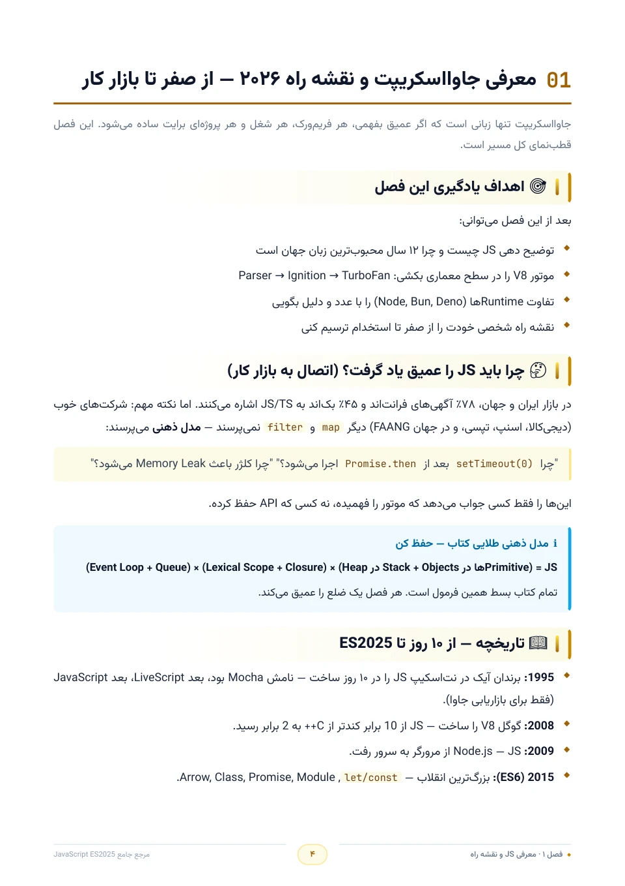
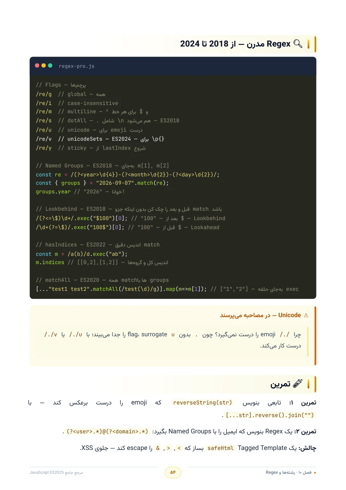
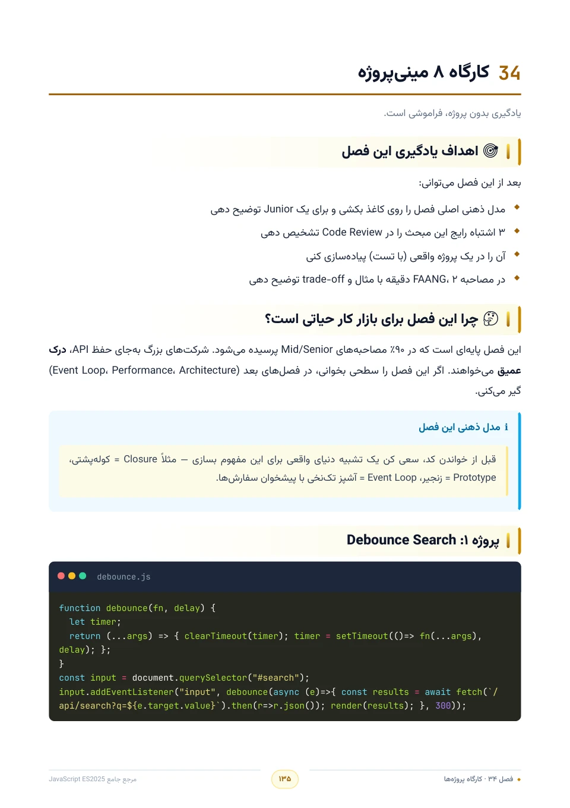
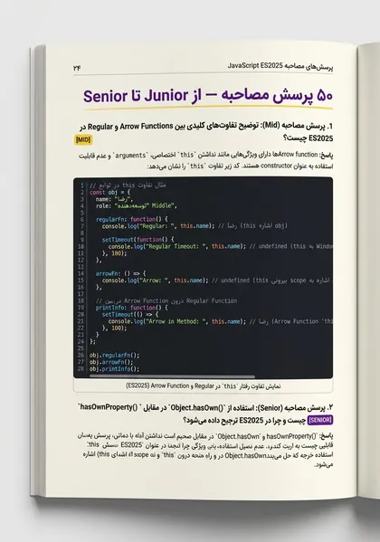

<a id="top"></a>

<p align="center">
  
</p>

<p align="center" dir="rtl">
  <strong>🎉 راهنمای کامل JavaScript ES2025 به زبان فارسی — رایگان و بدون محدودیت</strong>
</p>

<p align="center">
  <a href="https://rezaian-dev.github.io/javascript-persian-guide/"></a>
  <a href="./docs/pdf/JavaScript-Persian-Guide.pdf"></a>
  <a href="./docs/pdf/JavaScript-Persian-Guide.epub"></a>
</p>

<p align="center">
  
  
  
  
  
  
</p>

---

<div dir="rtl">

## ✨ این راهنما چیست؟

> **مرجع فارسی، پروژه‌محور و به‌روز JavaScript ES2025** — از مدل ذهنی زبان تا کد آمادهٔ Production.

جاوااسکریپت دنیای خودش را دارد: **Closure**، **Event Loop**، موتور **V8** و اکوسیستم مدرن ES2025. این کتاب همان‌ها را — از صفر تا سطح ارشد — با **زبان ساده، مدل ذهنی درست و کد واقعی** توضیح می‌دهد.

اینجا قرار نیست فهرست متدها را حفظ کنید؛ قرار است یاد بگیرید مثل یک مهندس ارشد **رفتار زبان را پیش‌بینی کنید، باگ را ریشه‌یابی کنید و معماری تمیز بچینید**. 🧠

## 👥 برای چه کسی؟

<table dir="rtl" align="center">
<tr><th align="center">🎯 اگر شما…</th><th align="right">📦 این کتاب به شما می‌دهد</th></tr>
<tr><td align="center">تازه وارد دنیای JS شده‌اید</td><td>مسیر یادگیری گام‌به‌گام از صفر تا درک عمیق زبان</td></tr>
<tr><td align="center">با JS کار کرده‌اید ولی سطحی</td><td>مدل ذهنی موتور: Closure، this، Prototype و Event Loop</td></tr>
<tr><td align="center">دنبال سطح ارشد هستید</td><td>V8، پرفورمنس، امنیت، تست و معماری تمیز</td></tr>
<tr><td align="center">در مسیر استخدام هستید</td><td>۵۰ پرسش مصاحبه با پاسخ تشریحی و واژه‌نامهٔ تخصصی</td></tr>
</table>

## 💎 چرا این کتاب متفاوت است؟

- ⚡ **همگام با ES2025** — `using`، متدهای جدید Set، `Promise.withResolvers`، Decorators و مرزبندی روشن با سینتکس قدیمی
- 🧠 **تمرکز بر «چرا»** — درک رفتار موتور و Event Loop به‌جای حفظ‌کردن سینتکس
- 💻 **کد واقعی، نه اسلایدهای تئوری** — ۱۷۳ پنجرهٔ کد JavaScript و ترمینال
- 🛠️ **یادگیری با دست** — ۸ مینی‌پروژهٔ کارگاهی از Debounce تا معماری ماژولار
- 🔐 **مهندسی از روز اول** — حافظه و GC، امنیت، تست، Tooling و الگوهای Production
- 🇮🇷 **فارسی روان، اصطلاح‌ها دوزبانه** — با واژه‌نامهٔ فارسی–انگلیسی پایان کتاب

## 🗺️ مسیر کتاب در یک نگاه

<table dir="rtl" align="center">
<tr><th align="center">🌱 بنیادها و مدل ذهنی<br><sub>فصل ۱–۱۲</sub></th><th align="center">🧩 مدرن و عمیق<br><sub>فصل ۱۳–۲۴</sub></th><th align="center">🏗️ مهندسی و Production<br><sub>فصل ۲۵–۳۲</sub></th><th align="center">🚀 کارگاه و آمادگی شغلی<br><sub>فصل ۳۳–۳۸</sub></th></tr>
<tr><td align="center">انواع داده، Scope، توابع،<br>Closure و مقدمهٔ Async</td><td align="center">Promise، Event Loop، ماژول،<br>Proxy و APIهای مرورگر</td><td align="center">V8، حافظه، امنیت،<br>تست و معماری تمیز</td><td align="center">ترفندها، مینی‌پروژه‌ها،<br>مصاحبه و نقشه راه</td></tr>
</table>

<sub>💡 مسیر پیشنهادی همین ترتیب است؛ اما اگر تجربه دارید، هر فصل مستقل هم خوانده می‌شود. [فهرست کامل فصل‌ها ↓](#chapters)</sub>

<a id="preview"></a>

## 🖼️ نگاهی به داخل کتاب

<p align="center">
  <a href="./assets/readme/page-toc.jpg"></a>
  <a href="./assets/readme/page-chapter.jpg"></a>
  <a href="./assets/readme/page-code.jpg"></a>
  <a href="./assets/readme/page-workshop.jpg"></a>
  <a href="./assets/readme/page-interview.jpg"></a>
</p>

## 📦 در چه قالبی می‌خواهید؟

<table dir="rtl" align="center">
<tr><th align="center">قالب</th><th align="center">مناسب برای</th><th align="center">لینک</th></tr>
<tr><td align="center">🌐 <strong>آنلاین</strong></td><td>مطالعهٔ فوری در مرورگر با پیوند مستقیم به هر فصل</td><td align="center"><a href="https://rezaian-dev.github.io/javascript-persian-guide/book/"><strong>شروع مطالعه</strong></a></td></tr>
<tr><td align="center">📕 <strong>PDF</strong></td><td>دانلود، جست‌وجو و چاپ — قطع A4 رنگی</td><td align="center"><a href="./docs/pdf/JavaScript-Persian-Guide.pdf"><strong>دانلود</strong></a></td></tr>
<tr><td align="center">📗 <strong>EPUB</strong></td><td>موبایل، تبلت و کتاب‌خوان</td><td align="center"><a href="./docs/pdf/JavaScript-Persian-Guide.epub"><strong>دانلود</strong></a></td></tr>
<tr><td align="center">🧰 <strong>سورس</strong></td><td>کد سایت و ابزارهای ساخت نسخهٔ آنلاین</td><td align="center"><a href="https://github.com/rezaian-dev/javascript-persian-guide"><strong>همین مخزن</strong></a></td></tr>
</table>

<a id="chapters"></a>

📚 **فهرست کامل ۳۸ فصل** — چهار بخش؛ هر بخش را جدا باز کنید:

<details>
<summary><strong>🌱 بخش اول — بنیادها و مدل ذهنی</strong> · فصل‌های ۱ تا ۱۲</summary>

1. [معرفی جاوااسکریپت و نقشه راه ۲۰۲۶ — از صفر تا بازار کار](https://rezaian-dev.github.io/javascript-persian-guide/book/#ch-01) — ص ۴
2. [محیط توسعه مدرن — ستاپ حرفه‌ای ۲۰۲۶](https://rezaian-dev.github.io/javascript-persian-guide/book/#ch-02) — ص ۹
3. [انواع داده و سیستم نوع — جایی که ۸۰٪ باگ‌ها متولد می‌شود](https://rezaian-dev.github.io/javascript-persian-guide/book/#ch-03) — ص ۱۵
4. [متغیرها، Scope و Hoisting — از صفر تا TDZ و Lexical](https://rezaian-dev.github.io/javascript-persian-guide/book/#ch-04) — ص ۲۱
5. [عملگرها و کنترل جریان — از if تا الگوهای مدرن ۲۰۲۵](https://rezaian-dev.github.io/javascript-persian-guide/book/#ch-05) — ص ۲۷
6. [توابع — قلب جاوااسکریپت — ۴ چهره یک مفهوم](https://rezaian-dev.github.io/javascript-persian-guide/book/#ch-06) — ص ۳۲
7. [کلژر و زنجیره Scope — مهم‌ترین مفهوم JS](https://rezaian-dev.github.io/javascript-persian-guide/book/#ch-07) — ص ۳۷
8. [اشیا و پروتوتایپ — راز ارث‌بری JS](https://rezaian-dev.github.io/javascript-persian-guide/book/#ch-08) — ص ۴۲
9. [آرایه‌ها — فراتر از لیست — شیء خاص با ترفندها](https://rezaian-dev.github.io/javascript-persian-guide/book/#ch-09) — ص ۴۶
10. [رشته‌ها و Regex — از Template Literal تا Unicode](https://rezaian-dev.github.io/javascript-persian-guide/book/#ch-10) — ص ۵۱
11. [this — راز بزرگ — با ۴ قانون حل می‌شود](https://rezaian-dev.github.io/javascript-persian-guide/book/#ch-11) — ص ۵۶
12. [مقدمه Async — از Callback Hell تا Promise — چرا JS بلاک نمی‌شود](https://rezaian-dev.github.io/javascript-persian-guide/book/#ch-12) — ص ۶۲

</details>

<details>
<summary><strong>🧩 بخش دوم — JavaScript مدرن و عمیق</strong> · فصل‌های ۱۳ تا ۲۴</summary>

13. [Destructuring، Spread و Rest](https://rezaian-dev.github.io/javascript-persian-guide/book/#ch-13) — ص ۶۷
14. [Iterator و Generator](https://rezaian-dev.github.io/javascript-persian-guide/book/#ch-14) — ص ۷۰
15. [Promise پیشرفته و Async/Await](https://rezaian-dev.github.io/javascript-persian-guide/book/#ch-15) — ص ۷۴
16. [Event Loop و مدل همزمانی](https://rezaian-dev.github.io/javascript-persian-guide/book/#ch-16) — ص ۷۷
17. [ماژول‌ها — ESM و CJS عمیق](https://rezaian-dev.github.io/javascript-persian-guide/book/#ch-17) — ص ۸۰
18. [کلاس‌ها و OOP در JS](https://rezaian-dev.github.io/javascript-persian-guide/book/#ch-18) — ص ۸۳
19. [مدیریت خطا — حرفه‌ای](https://rezaian-dev.github.io/javascript-persian-guide/book/#ch-19) — ص ۸۶
20. [کالکشن‌های پیشرفته](https://rezaian-dev.github.io/javascript-persian-guide/book/#ch-20) — ص ۸۹
21. [Proxy و Reflect — متاپروگرامینگ](https://rezaian-dev.github.io/javascript-persian-guide/book/#ch-21) — ص ۹۲
22. [برنامه‌نویسی فانکشنال در JS](https://rezaian-dev.github.io/javascript-persian-guide/book/#ch-22) — ص ۹۵
23. [DOM و BOM — جاوااسکریپت در مرورگر](https://rezaian-dev.github.io/javascript-persian-guide/book/#ch-23) — ص ۹۸
24. [Fetch، Storage و APIهای مرورگر](https://rezaian-dev.github.io/javascript-persian-guide/book/#ch-24) — ص ۱۰۱

</details>

<details>
<summary><strong>🏗️ بخش سوم — مهندسی و Production</strong> · فصل‌های ۲۵ تا ۳۲</summary>

25. [پرفورمنس و بهینه‌سازی](https://rezaian-dev.github.io/javascript-persian-guide/book/#ch-25) — ص ۱۰۴
26. [حافظه و Garbage Collection](https://rezaian-dev.github.io/javascript-persian-guide/book/#ch-26) — ص ۱۰۷
27. [امنیت در جاوااسکریپت](https://rezaian-dev.github.io/javascript-persian-guide/book/#ch-27) — ص ۱۱۰
28. [تست‌نویسی مدرن](https://rezaian-dev.github.io/javascript-persian-guide/book/#ch-28) — ص ۱۱۳
29. [ابزارها و باندلرها](https://rezaian-dev.github.io/javascript-persian-guide/book/#ch-29) — ص ۱۱۶
30. [TypeScript و تعامل با JS](https://rezaian-dev.github.io/javascript-persian-guide/book/#ch-30) — ص ۱۱۹
31. [الگوها و معماری تمیز](https://rezaian-dev.github.io/javascript-persian-guide/book/#ch-31) — ص ۱۲۲
32. [متاپروگرامینگ پیشرفته](https://rezaian-dev.github.io/javascript-persian-guide/book/#ch-32) — ص ۱۲۶

</details>

<details>
<summary><strong>🚀 بخش چهارم — کارگاه و آمادگی شغلی</strong> · فصل‌های ۳۳ تا ۳۸</summary>

33. [۳۰ نکته و ترفند طلایی](https://rezaian-dev.github.io/javascript-persian-guide/book/#ch-33) — ص ۱۲۹
34. [کارگاه ۸ مینی‌پروژه](https://rezaian-dev.github.io/javascript-persian-guide/book/#ch-34) — ص ۱۳۵
35. [۲۰ اشتباه رایج و راه‌حل](https://rezaian-dev.github.io/javascript-persian-guide/book/#ch-35) — ص ۱۴۰
36. [۵۰ پرسش مصاحبه — از Junior تا Senior](https://rezaian-dev.github.io/javascript-persian-guide/book/#ch-36) — ص ۱۴۴
37. [واژه‌نامه فارسی-انگلیسی](https://rezaian-dev.github.io/javascript-persian-guide/book/#ch-37) — ص ۱۴۷
38. [نقشه راه بعد از کتاب](https://rezaian-dev.github.io/javascript-persian-guide/book/#ch-38) — ص ۱۵۲

</details>

<a id="quickstart"></a>

## 🚀 دو قدم تا شروع

۱. **سریع‌ترین راه:** کتاب را همان [نسخهٔ آنلاین](https://rezaian-dev.github.io/javascript-persian-guide/book/) بخوانید — نصب لازم نیست. ⚡

۲. **اگر سورس را می‌خواهید:**

```bash
git clone https://github.com/rezaian-dev/javascript-persian-guide.git
cd javascript-persian-guide && npm install && npm run dev
```

#### 🛠️ بیلد کامل: سایت (Next.js) و نسخهٔ آنلاین (Python)


```bash
# سایت — بیلد استاتیک برای GitHub Pages
npm run build        # بیلد استاندارد (Vercel / Node)
npm run build:pages  # خروجی استاتیک در out/ با basePath

# نسخهٔ آنلاین — از روی PDF کامیت‌شده (پیش‌نیاز Python 3.10+)
python -m venv .venv && source .venv/bin/activate
python -m pip install -r src/requirements.txt
python src/tools/build_reader.py         # نسخهٔ آنلاین در public/book/
python src/tools/build_reader.py --check # بررسی به‌روزبودن نسخهٔ آنلاین
```

```text
src/app/        صفحه‌ها و layout اپ Next.js
src/components/ کامپوننت‌های رابط کاربری
src/lib/        داده فصل‌ها و پیوندها
src/edition/    شناسنامهٔ فصل‌ها (chapters.json)
src/tools/      ابزار ساخت نسخهٔ آنلاین از روی PDF
src/fonts/      فونت‌ها (WOFF2 برای سایت و ریدر)
public/         دارایی‌ها، PDF، EPUB و نسخهٔ آنلاین
docs/           خروجی منتشرشده روی GitHub Pages
assets/         تصاویر README
```


## 🧩 مجموعهٔ کامل راهنماهای فارسی

چهار مرجع، یک مسیر هماهنگ برای فرانت‌اند مدرن:

<table dir="rtl" align="center">
<tr><th align="right">راهنما</th><th align="center">موضوع</th><th align="center">لینک‌ها</th></tr>
<tr><td>🌱 <a href="https://github.com/rezaian-dev/git-github-persian-guide"><strong>Git و GitHub ۲۰۲۶</strong></a></td><td align="center">نسخه‌بندی، VS Code و همکاری</td><td align="center"><a href="https://rezaian-dev.github.io/git-github-persian-guide/">آنلاین</a></td></tr>
<tr><td>🟨 <a href="https://github.com/rezaian-dev/javascript-persian-guide"><strong>JavaScript ES2025</strong></a></td><td align="center">زبان و مدل ذهنی</td><td align="center"><a href="https://rezaian-dev.github.io/javascript-persian-guide/">آنلاین</a> · 📍 <strong>همین کتاب</strong></td></tr>
<tr><td>⚛️ <a href="https://github.com/rezaian-dev/react-19-persian-guide"><strong>React 19.2</strong></a></td><td align="center">رابط کاربری، state و معماری</td><td align="center"><a href="https://rezaian-dev.github.io/react-19-persian-guide/">آنلاین</a></td></tr>
<tr><td>▲ <a href="https://github.com/rezaian-dev/nextjs-16-persian-guide"><strong>Next.js 16</strong></a></td><td align="center">فریم‌ورک، رندر سرور و استقرار</td><td align="center"><a href="https://rezaian-dev.github.io/nextjs-16-persian-guide/">آنلاین</a></td></tr>
</table>

## 🤝 مشارکت

خطایی دیدید؟ پیشنهادی دارید؟ یک [Issue](https://github.com/rezaian-dev/javascript-persian-guide/issues) باز کنید 🐛 — PRهای کوچک و متمرکز هم همیشه خوش‌آمدند. 🙏

## ✍️ نویسنده و مجوز

**محمدرضا رضائیان** — [@rezaian-dev](https://github.com/rezaian-dev)

این اثر با مجوز [Creative Commons BY-NC-SA 4.0](./LICENSE) منتشر شده است: استفاده و بازنشر غیرتجاری با ذکر منبع آزاد است و نسخهٔ اقتباسی باید با همین مجوز منتشر شود. ⚖️

</div>

---

<p align="center" dir="rtl">
  ⭐ اگر این راهنما برایتان مفید بود، با ثبت یک ستاره از ادامهٔ راه مجموعه حمایت کنید.
  <br>
  <a href="#top">بازگشت به بالا ↑</a>
</p>
