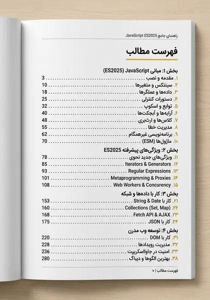
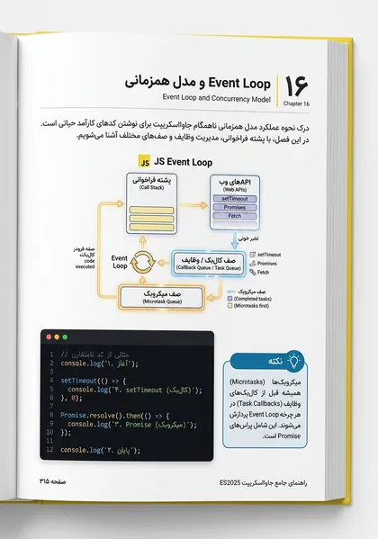
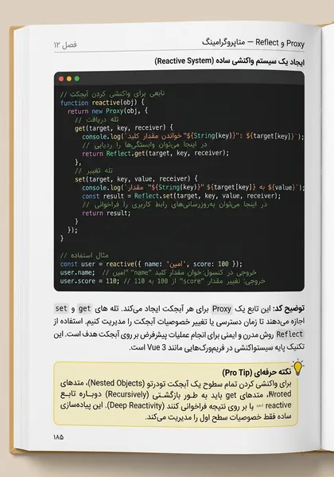
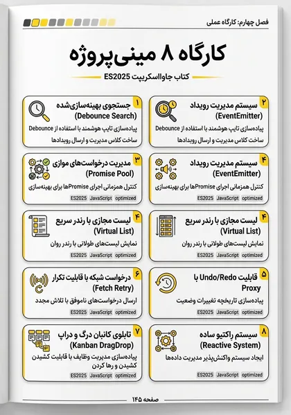

<a id="top"></a>

<p align="center">
  
</p>

<p align="center" dir="rtl">
  <strong>از مدل ذهنی زبان تا معماری و کد آمادهٔ محیط Production</strong>
  <br>
  مسیر فارسی و پروژه‌محور برای فهم رفتار JavaScript؛ از Scope، Closure و Event Loop تا V8، امنیت، تست و معماری تمیز.
</p>

<p align="center">
  <a href="https://rezaian-dev.github.io/javascript-persian-guide/"></a>
  <a href="./docs/pdf/JavaScript-Persian-Guide.pdf"></a>
  <a href="./docs/pdf/JavaScript-Persian-Guide.epub"></a>
</p>

<p align="center">
  
  
  
  
  
</p>

<p align="center" dir="rtl">
  <a href="#about">درباره</a> ·
  <a href="#path">مسیر یادگیری</a> ·
  <a href="#chapters">فهرست فصل‌ها</a> ·
  <a href="#preview">پیش‌نمایش</a> ·
  <a href="#editions">نسخه‌ها</a> ·
  <a href="#build">ساخت از سورس</a> ·
  <a href="#collection">مجموعه</a>
</p>

---

<div dir="rtl">

<a id="about"></a>

## درباره راهنما

مرجع فارسی JavaScript ES2025 در ۳۸ فصل؛ از مبانی و مدل ذهنی تا Event Loop، V8، امنیت، تست، TypeScript و معماری. دانلود رایگان PDF و EPUB.

این راهنما بر **مدل ذهنی، تحلیل رفتار و تصمیم‌گیری فنی** تمرکز دارد. هدف این نیست که مجموعه‌ای از APIها حفظ شود؛ هدف این است که بتوانید مسئله را بفهمید، راه‌حل را ارزیابی کنید و کدی بنویسید که در پروژهٔ واقعی قابل نگهداری باشد.

### ویژگی‌ها

- **مدل ذهنی، نه حفظ API:** Scope، Closure، this، Prototype و Event Loop با تمرکز بر چرایی رفتار زبان توضیح داده می‌شوند.
- **همگام با ES2025:** قابلیت‌های مدرن زبان در کنار مرزبندی روشن میان APIهای پایدار، الگوهای جدید و کد Legacy.
- **کد قابل اجرا و پروژه‌محور:** مثال‌های مرحله‌ای و ۸ مینی‌پروژه برای تبدیل مفهوم به مهارت حل مسئله و طراحی کد.
- **V8، حافظه و Performance:** Hidden Class، بهینه‌سازی اجرا، Garbage Collection و Memory Leak با نگاه عملی.
- **کیفیت در Production:** تست، امنیت، مدیریت خطا، ابزارهای ساخت و اصول نگهداری‌پذیری در پروژه‌های واقعی.
- **مرجع سریع و آمادگی مصاحبه:** نکات کلیدی، خطاهای رایج، واژه‌نامه و پرسش‌های سطح‌بندی‌شده برای مرور هدفمند.

<a id="path"></a>

## مسیر یادگیری

### ۱. بنیادها و مدل ذهنی

**فصل‌های ۱ تا ۱۲** — انواع داده، Scope، توابع، Closure، اشیا، Prototype، this و مقدمهٔ برنامه‌نویسی ناهمگام.

دستاورد: **ساخت مدل ذهنی و درک رفتار پایه**

### ۲. JavaScript مدرن و عمیق

**فصل‌های ۱۳ تا ۲۴** — Iterator، Generator، Promise، Event Loop، ESM، Proxy، برنامه‌نویسی تابعی و APIهای مرورگر.

دستاورد: **تسلط بر الگوها و قابلیت‌های مدرن**

### ۳. مهندسی و Production

**فصل‌های ۲۵ تا ۳۲** — Performance، V8، حافظه، امنیت، تست، Tooling، TypeScript و معماری تمیز.

دستاورد: **طراحی کد پایدار و قابل نگهداری**

### ۴. کارگاه و آمادگی شغلی

**فصل‌های ۳۳ تا ۳۸** — ترفندهای کاربردی، مینی‌پروژه‌ها، اشتباهات رایج، پرسش‌های مصاحبه، واژه‌نامه و نقشه راه.

دستاورد: **تثبیت آموخته‌ها و آمادگی پروژه**

> برای مطالعهٔ پیوسته از بخش اول شروع کنید. اگر تجربهٔ عملی دارید، می‌توانید مستقیماً به مرحلهٔ متناسب با نیاز فعلی خود بروید.

<a id="chapters"></a>

## فهرست فصل‌ها

فهرست کامل در چهار بخش جمع شده است تا صفحه خلوت بماند. برای مشاهدهٔ فصل‌ها، هر بخش را باز کنید.

<details>
<summary><strong>بخش اول — بنیادها و مدل ذهنی</strong> · فصل‌های ۱ تا ۱۲</summary>

1. [معرفی جاوااسکریپت و نقشه راه ۲۰۲۶ — از صفر تا بازار کار](./src/chapters/01-intro.md)
2. [محیط توسعه مدرن — ستاپ حرفه‌ای ۲۰۲۶](./src/chapters/02-setup.md)
3. [انواع داده و سیستم نوع — جایی که ۸۰٪ باگ‌ها متولد می‌شود](./src/chapters/03-types-values.md)
4. [متغیرها، Scope و Hoisting — از صفر تا TDZ و Lexical](./src/chapters/04-variables-scope.md)
5. [عملگرها و کنترل جریان — از if تا الگوهای مدرن ۲۰۲۵](./src/chapters/05-operators-control.md)
6. [توابع — قلب جاوااسکریپت — ۴ چهره یک مفهوم](./src/chapters/06-functions.md)
7. [کلژر و زنجیره Scope — مهم‌ترین مفهوم JS](./src/chapters/07-closures-scope-chain.md)
8. [اشیا و پروتوتایپ — راز ارث‌بری JS](./src/chapters/08-objects-prototypes.md)
9. [آرایه‌ها — فراتر از لیست — شیء خاص با ترفندها](./src/chapters/09-arrays.md)
10. [رشته‌ها و Regex — از Template Literal تا Unicode](./src/chapters/10-strings-regex.md)
11. [this — راز بزرگ — با ۴ قانون حل می‌شود](./src/chapters/11-this-binding.md)
12. [مقدمه Async — از Callback Hell تا Promise — چرا JS بلاک نمی‌شود](./src/chapters/12-async-intro.md)

</details>

<details>
<summary><strong>بخش دوم — JavaScript مدرن و عمیق</strong> · فصل‌های ۱۳ تا ۲۴</summary>

13. [Destructuring، Spread و Rest](./src/chapters/13-destructuring-spread.md)
14. [Iterator و Generator](./src/chapters/14-iterators-generators.md)
15. [Promise پیشرفته و Async/Await](./src/chapters/15-promise-async-await.md)
16. [Event Loop و مدل همزمانی](./src/chapters/16-event-loop-concurrency.md)
17. [ماژول‌ها — ESM و CJS عمیق](./src/chapters/17-modules-esm-cjs.md)
18. [کلاس‌ها و OOP در JS](./src/chapters/18-classes-oop.md)
19. [مدیریت خطا — حرفه‌ای](./src/chapters/19-error-handling.md)
20. [کالکشن‌های پیشرفته](./src/chapters/20-collections-map-set.md)
21. [Proxy و Reflect — متاپروگرامینگ](./src/chapters/21-proxy-reflect.md)
22. [برنامه‌نویسی فانکشنال در JS](./src/chapters/22-functional-programming.md)
23. [DOM و BOM — جاوااسکریپت در مرورگر](./src/chapters/23-dom-bom.md)
24. [Fetch، Storage و APIهای مرورگر](./src/chapters/24-fetch-api-storage.md)

</details>

<details>
<summary><strong>بخش سوم — مهندسی و Production</strong> · فصل‌های ۲۵ تا ۳۲</summary>

25. [پرفورمنس و بهینه‌سازی](./src/chapters/25-performance-optimization.md)
26. [حافظه و Garbage Collection](./src/chapters/26-memory-gc.md)
27. [امنیت در جاوااسکریپت](./src/chapters/27-security.md)
28. [تست‌نویسی مدرن](./src/chapters/28-testing.md)
29. [ابزارها و باندلرها](./src/chapters/29-tooling-bundlers.md)
30. [TypeScript و تعامل با JS](./src/chapters/30-typescript-interop.md)
31. [الگوها و معماری تمیز](./src/chapters/31-patterns-architecture.md)
32. [متاپروگرامینگ پیشرفته](./src/chapters/32-meta-programming.md)

</details>

<details>
<summary><strong>بخش چهارم — کارگاه و آمادگی شغلی</strong> · فصل‌های ۳۳ تا ۳۸</summary>

33. [۳۰ نکته و ترفند طلایی](./src/chapters/33-tips-tricks.md)
34. [کارگاه ۸ مینی‌پروژه](./src/chapters/34-workshop.md)
35. [۲۰ اشتباه رایج و راه‌حل](./src/chapters/35-mistakes.md)
36. [۵۰ پرسش مصاحبه — از Junior تا Senior](./src/chapters/36-interview.md)
37. [واژه‌نامه فارسی-انگلیسی](./src/chapters/37-glossary.md)
38. [نقشه راه بعد از کتاب](./src/chapters/38-roadmap-next.md)

</details>

<a id="preview"></a>

## پیش‌نمایش

<p align="center">
  <a href="./docs/assets/page-toc.jpg"></a>
  <a href="./docs/assets/page-chapter.jpg"></a>
  <a href="./docs/assets/page-code.jpg"></a>
  <a href="./docs/assets/page-workshop.jpg"></a>
</p>

<a id="editions"></a>

## نسخه‌های در دسترس

### PDF — [نسخهٔ اصلی](./docs/pdf/JavaScript-Persian-Guide.pdf)

**۱۵۶ صفحه · A4** — نسخهٔ رنگی و قابل جست‌وجو برای مطالعه روی دسکتاپ و تبلت.

### EPUB — [نسخهٔ کتاب‌خوان](./docs/pdf/JavaScript-Persian-Guide.epub)

**راست‌به‌چپ · مناسب موبایل** — نسخهٔ بازچینش‌پذیر برای موبایل، تبلت و نرم‌افزارهای مطالعه EPUB.

### GITHUB — [سورس و فصل‌ها](https://github.com/rezaian-dev/javascript-persian-guide)

**Markdown · Python** — متن فصل‌ها، ابزار ساخت PDF و دارایی‌های پروژه در مخزن عمومی نگهداری می‌شوند.

<a id="build"></a>

## ساخت از سورس

پیش‌نیاز اصلی Python 3.10 یا جدیدتر است. برای تولید PDF، وابستگی‌های سیستمی [WeasyPrint](https://doc.courtbouillon.org/weasyprint/stable/first_steps.html#installation) نیز باید نصب باشند.

### راه‌اندازی

```bash
git clone https://github.com/rezaian-dev/javascript-persian-guide.git
cd javascript-persian-guide

python -m venv .venv
source .venv/bin/activate       # macOS / Linux
# .venv\Scripts\Activate.ps1   # Windows PowerShell

python -m pip install -r src/requirements.txt
python src/build.py --html      # پیش‌نمایش HTML
python src/build.py             # PDF رنگی
python src/build.py --print     # نسخه مناسب چاپ
```

### ساختار اصلی

```text
.
├── docs/                       # سایت، تصاویر و خروجی‌ها
│   ├── assets/
│   ├── index.html
│   └── pdf/
└── src/
    ├── chapters/               # متن ۳۸ فصل
    ├── fonts/                  # فونت‌های محلی
    ├── build.py                # سازنده HTML و PDF
    ├── build_epub.py
    └── style*.css
```

<a id="collection"></a>

## مجموعه راهنماهای فارسی

این سه مرجع یک مسیر هماهنگ می‌سازند: ابتدا زبان JavaScript، سپس معماری رابط کاربری با React و در پایان توسعهٔ کامل با Next.js.

- **[JavaScript ES2025](https://github.com/rezaian-dev/javascript-persian-guide)** — زبان و مدل ذهنی؛ پایهٔ مشترک مسیر توسعه وب · [نسخه آنلاین](https://rezaian-dev.github.io/javascript-persian-guide/) — **راهنمای فعلی**
- **[React 19.2](https://github.com/rezaian-dev/react-19-persian-guide)** — رابط کاربری، مدیریت state و معماری کامپوننت · [نسخه آنلاین](https://rezaian-dev.github.io/react-19-persian-guide/)
- **[Next.js 16](https://github.com/rezaian-dev/nextjs-16-persian-guide)** — فریم‌ورک، رندر سرور، کشینگ و استقرار · [نسخه آنلاین](https://rezaian-dev.github.io/nextjs-16-persian-guide/)

## مشارکت

برای گزارش خطا، پیشنهاد اصلاح یا بهبود محتوا از [Issues](https://github.com/rezaian-dev/javascript-persian-guide/issues) استفاده کنید. Pull Requestها بهتر است کوچک، متمرکز و همراه با توضیح روشن دربارهٔ دلیل تغییر باشند.

- [گزارش یک مشکل](https://github.com/rezaian-dev/javascript-persian-guide/issues)
- [مشاهده مخزن](https://github.com/rezaian-dev/javascript-persian-guide)

## نویسنده و مجوز

**محمدرضا رضائیان** — [@rezaian-dev](https://github.com/rezaian-dev)

این اثر با مجوز [Creative Commons BY-NC-SA 4.0](./LICENSE) منتشر شده است. استفاده و بازنشر غیرتجاری با ذکر منبع مجاز است و نسخهٔ اقتباسی باید با همین مجوز منتشر شود.

</div>

---

<p align="center" dir="rtl">
  اگر این راهنما برایتان مفید بود، با ثبت یک ⭐ از ادامهٔ توسعهٔ مجموعه حمایت کنید.
  <br>
  <a href="#top">بازگشت به بالا</a>
</p>
