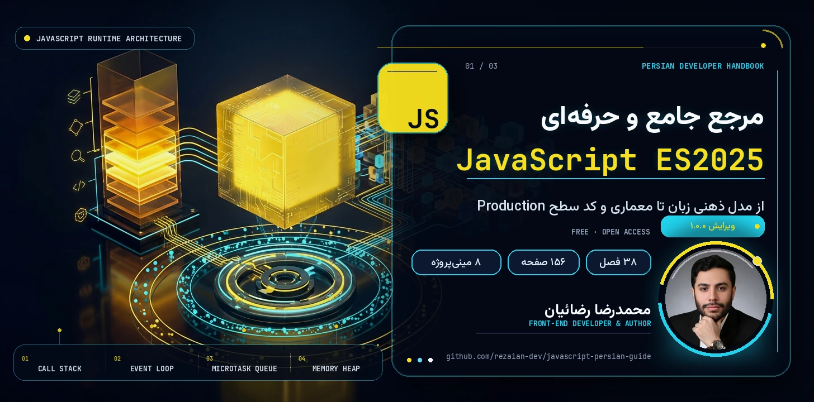

<a id="top"></a>

<p align="center">
  
</p>

<p align="center" dir="rtl">
  <strong>🎉 راهنمای کامل JavaScript ES2025 به زبان فارسی — رایگان و بدون محدودیت</strong>
</p>

<p align="center">
  <a href="https://rezaian-dev.github.io/javascript-persian-guide/"></a>
  <a href="./docs/pdf/JavaScript-Persian-Guide.pdf"></a>
  <a href="./docs/pdf/JavaScript-Persian-Guide.epub"></a>
</p>

<p align="center">
  
  
  
  
  
  
</p>

---

<div dir="rtl">

## ✨ این راهنما چیست؟

> **مرجع فارسی، پروژه‌محور و به‌روز JavaScript ES2025** — از مدل ذهنی زبان تا کد آمادهٔ Production.

جاوااسکریپت فقط یک زبان نیست؛ یک طرز فکر است: **Scope**، **Closure**، **Event Loop**، موتور **V8** و اکوسیستم مدرن. این کتاب همان‌ها را — با **زبان ساده، مدل ذهنی درست و کد واقعی** — قدم‌به‌قدم توضیح می‌دهد.

اینجا قرار نیست فهرست متدها را حفظ کنید؛ قرار است یاد بگیرید مثل یک مهندس ارشد **رفتار زبان را پیش‌بینی کنید، باگ را ریشه‌یابی کنید و معماری تمیز بچینید**. 🧠

## 👥 برای چه کسی؟

<table dir="rtl" align="center">
<tr><th align="center">🎯 اگر شما…</th><th align="right">📦 این کتاب به شما می‌دهد</th></tr>
<tr><td align="center">تازه وارد دنیای JS شده‌اید</td><td>مسیر یادگیری گام‌به‌گام از صفر تا درک عمیق زبان</td></tr>
<tr><td align="center">با JS کار کرده‌اید ولی سطحی</td><td>مدل ذهنی موتور: Closure، this، Prototype و Event Loop</td></tr>
<tr><td align="center">دنبال سطح ارشد هستید</td><td>V8، پرفورمنس، امنیت، تست و معماری تمیز</td></tr>
<tr><td align="center">در مسیر استخدام هستید</td><td>۵۰ پرسش مصاحبه با پاسخ تشریحی و واژه‌نامهٔ تخصصی</td></tr>
</table>

## 💎 چرا این کتاب متفاوت است؟

- ⚡ **همگام با ES2025** — `using`، متدهای Set، `Promise.withResolvers`، Decorators و مرزبندی روشن با Legacy
- 🧠 **تمرکز بر «چرا»** — درک رفتار موتور و Event Loop به‌جای حفظ‌کردن سینتکس
- 💻 **کد واقعی، نه اسلایدهای تئوری** — ۱۷۳ پنجرهٔ کد JavaScript و ترمینال
- 🛠️ **یادگیری با دست** — ۸ مینی‌پروژهٔ کارگاهی از Debounce تا معماری ماژولار
- 🔐 **مهندسی از روز اول** — حافظه و GC، امنیت، تست، Tooling و الگوهای Production
- 🇮🇷 **فارسی روان، اصطلاح‌ها دوزبانه** — با واژه‌نامهٔ فارسی–انگلیسی پایان کتاب

## 🗺️ مسیر کتاب در یک نگاه

<table dir="rtl" align="center">
<tr><th align="center">🌱 بنیادها و مدل ذهنی<br><sub>فصل ۱–۱۲</sub></th><th align="center">🧩 مدرن و عمیق<br><sub>فصل ۱۳–۲۴</sub></th><th align="center">🏗️ مهندسی و Production<br><sub>فصل ۲۵–۳۲</sub></th><th align="center">🚀 کارگاه و آمادگی شغلی<br><sub>فصل ۳۳–۳۸</sub></th></tr>
<tr><td align="center">انواع داده، Scope، توابع،<br>Closure و مقدمهٔ Async</td><td align="center">Promise، Event Loop، ماژول،<br>Proxy و APIهای مرورگر</td><td align="center">V8، حافظه، امنیت،<br>تست و معماری تمیز</td><td align="center">ترفندها، مینی‌پروژه‌ها،<br>مصاحبه و نقشه راه</td></tr>
</table>

<sub>💡 مسیر پیشنهادی همین ترتیب است؛ اما اگر تجربه دارید، هر فصل مستقل هم خوانده می‌شود. [فهرست کامل فصل‌ها ↓](#chapters)</sub>

<a id="preview"></a>

## 🖼️ نگاهی به داخل کتاب

<p align="center">
  <a href="./assets/readme/page-toc.jpg"></a>
  <a href="./assets/readme/page-chapter.jpg"></a>
  <a href="./assets/readme/page-code.jpg"></a>
  <a href="./assets/readme/page-workshop.jpg"></a>
  <a href="./assets/readme/page-interview.jpg"></a>
</p>

## 📦 در چه قالبی می‌خواهید؟

<table dir="rtl" align="center">
<tr><th align="center">قالب</th><th align="center">مناسب برای</th><th align="center">لینک</th></tr>
<tr><td align="center">🌐 <strong>آنلاین</strong></td><td>فهرست ۳۸ فصل با پیوند مستقیم به متن کامل هر فصل</td><td align="center"><a href="https://rezaian-dev.github.io/javascript-persian-guide/chapters/"><strong>شروع مطالعه</strong></a></td></tr>
<tr><td align="center">📕 <strong>PDF</strong></td><td>دانلود، جست‌وجو و چاپ — قطع A4 رنگی</td><td align="center"><a href="./docs/pdf/JavaScript-Persian-Guide.pdf"><strong>دانلود</strong></a></td></tr>
<tr><td align="center">📗 <strong>EPUB</strong></td><td>موبایل، تبلت و کتاب‌خوان — متن بازچینش‌پذیر</td><td align="center"><a href="./docs/pdf/JavaScript-Persian-Guide.epub"><strong>دانلود</strong></a></td></tr>
<tr><td align="center">🧰 <strong>سورس</strong></td><td>متن فصل‌ها، کد سایت و ابزارهای ساخت کتاب</td><td align="center"><a href="https://github.com/rezaian-dev/javascript-persian-guide"><strong>همین مخزن</strong></a></td></tr>
</table>

<a id="chapters"></a>

📚 **فهرست کامل ۳۸ فصل** — چهار بخش؛ هر بخش را جدا باز کنید:

<details>
<summary><strong>🌱 بخش اول — بنیادها و مدل ذهنی</strong> · فصل‌های ۱ تا ۱۲</summary>

1. [معرفی جاوااسکریپت و نقشه راه ۲۰۲۶ — از صفر تا بازار کار](https://github.com/rezaian-dev/javascript-persian-guide/blob/main/src/chapters/01-intro.md)
2. [محیط توسعه مدرن — ستاپ حرفه‌ای ۲۰۲۶](https://github.com/rezaian-dev/javascript-persian-guide/blob/main/src/chapters/02-setup.md)
3. [انواع داده و سیستم نوع — جایی که ۸۰٪ باگ‌ها متولد می‌شود](https://github.com/rezaian-dev/javascript-persian-guide/blob/main/src/chapters/03-types-values.md)
4. [متغیرها، Scope و Hoisting — از صفر تا TDZ و Lexical](https://github.com/rezaian-dev/javascript-persian-guide/blob/main/src/chapters/04-variables-scope.md)
5. [عملگرها و کنترل جریان — از if تا الگوهای مدرن ۲۰۲۵](https://github.com/rezaian-dev/javascript-persian-guide/blob/main/src/chapters/05-operators-control.md)
6. [توابع — قلب جاوااسکریپت — ۴ چهره یک مفهوم](https://github.com/rezaian-dev/javascript-persian-guide/blob/main/src/chapters/06-functions.md)
7. [کلژر و زنجیره Scope — مهم‌ترین مفهوم JS](https://github.com/rezaian-dev/javascript-persian-guide/blob/main/src/chapters/07-closures-scope-chain.md)
8. [اشیا و پروتوتایپ — راز ارث‌بری JS](https://github.com/rezaian-dev/javascript-persian-guide/blob/main/src/chapters/08-objects-prototypes.md)
9. [آرایه‌ها — فراتر از لیست — شیء خاص با ترفندها](https://github.com/rezaian-dev/javascript-persian-guide/blob/main/src/chapters/09-arrays.md)
10. [رشته‌ها و Regex — از Template Literal تا Unicode](https://github.com/rezaian-dev/javascript-persian-guide/blob/main/src/chapters/10-strings-regex.md)
11. [this — راز بزرگ — با ۴ قانون حل می‌شود](https://github.com/rezaian-dev/javascript-persian-guide/blob/main/src/chapters/11-this-binding.md)
12. [مقدمه Async — از Callback Hell تا Promise — چرا JS بلاک نمی‌شود](https://github.com/rezaian-dev/javascript-persian-guide/blob/main/src/chapters/12-async-intro.md)

</details>

<details>
<summary><strong>🧩 بخش دوم — JavaScript مدرن و عمیق</strong> · فصل‌های ۱۳ تا ۲۴</summary>

13. [Destructuring، Spread و Rest](https://github.com/rezaian-dev/javascript-persian-guide/blob/main/src/chapters/13-destructuring-spread.md)
14. [Iterator و Generator](https://github.com/rezaian-dev/javascript-persian-guide/blob/main/src/chapters/14-iterators-generators.md)
15. [Promise پیشرفته و Async/Await](https://github.com/rezaian-dev/javascript-persian-guide/blob/main/src/chapters/15-promise-async-await.md)
16. [Event Loop و مدل همزمانی](https://github.com/rezaian-dev/javascript-persian-guide/blob/main/src/chapters/16-event-loop-concurrency.md)
17. [ماژول‌ها — ESM و CJS عمیق](https://github.com/rezaian-dev/javascript-persian-guide/blob/main/src/chapters/17-modules-esm-cjs.md)
18. [کلاس‌ها و OOP در JS](https://github.com/rezaian-dev/javascript-persian-guide/blob/main/src/chapters/18-classes-oop.md)
19. [مدیریت خطا — حرفه‌ای](https://github.com/rezaian-dev/javascript-persian-guide/blob/main/src/chapters/19-error-handling.md)
20. [کالکشن‌های پیشرفته](https://github.com/rezaian-dev/javascript-persian-guide/blob/main/src/chapters/20-collections-map-set.md)
21. [Proxy و Reflect — متاپروگرامینگ](https://github.com/rezaian-dev/javascript-persian-guide/blob/main/src/chapters/21-proxy-reflect.md)
22. [برنامه‌نویسی فانکشنال در JS](https://github.com/rezaian-dev/javascript-persian-guide/blob/main/src/chapters/22-functional-programming.md)
23. [DOM و BOM — جاوااسکریپت در مرورگر](https://github.com/rezaian-dev/javascript-persian-guide/blob/main/src/chapters/23-dom-bom.md)
24. [Fetch، Storage و APIهای مرورگر](https://github.com/rezaian-dev/javascript-persian-guide/blob/main/src/chapters/24-fetch-api-storage.md)

</details>

<details>
<summary><strong>🏗️ بخش سوم — مهندسی و Production</strong> · فصل‌های ۲۵ تا ۳۲</summary>

25. [پرفورمنس و بهینه‌سازی](https://github.com/rezaian-dev/javascript-persian-guide/blob/main/src/chapters/25-performance-optimization.md)
26. [حافظه و Garbage Collection](https://github.com/rezaian-dev/javascript-persian-guide/blob/main/src/chapters/26-memory-gc.md)
27. [امنیت در جاوااسکریپت](https://github.com/rezaian-dev/javascript-persian-guide/blob/main/src/chapters/27-security.md)
28. [تست‌نویسی مدرن](https://github.com/rezaian-dev/javascript-persian-guide/blob/main/src/chapters/28-testing.md)
29. [ابزارها و باندلرها](https://github.com/rezaian-dev/javascript-persian-guide/blob/main/src/chapters/29-tooling-bundlers.md)
30. [TypeScript و تعامل با JS](https://github.com/rezaian-dev/javascript-persian-guide/blob/main/src/chapters/30-typescript-interop.md)
31. [الگوها و معماری تمیز](https://github.com/rezaian-dev/javascript-persian-guide/blob/main/src/chapters/31-patterns-architecture.md)
32. [متاپروگرامینگ پیشرفته](https://github.com/rezaian-dev/javascript-persian-guide/blob/main/src/chapters/32-meta-programming.md)

</details>

<details>
<summary><strong>🚀 بخش چهارم — کارگاه و آمادگی شغلی</strong> · فصل‌های ۳۳ تا ۳۸</summary>

33. [۳۰ نکته و ترفند طلایی](https://github.com/rezaian-dev/javascript-persian-guide/blob/main/src/chapters/33-tips-tricks.md)
34. [کارگاه ۸ مینی‌پروژه](https://github.com/rezaian-dev/javascript-persian-guide/blob/main/src/chapters/34-workshop.md)
35. [۲۰ اشتباه رایج و راه‌حل](https://github.com/rezaian-dev/javascript-persian-guide/blob/main/src/chapters/35-mistakes.md)
36. [۵۰ پرسش مصاحبه — از Junior تا Senior](https://github.com/rezaian-dev/javascript-persian-guide/blob/main/src/chapters/36-interview.md)
37. [واژه‌نامه فارسی-انگلیسی](https://github.com/rezaian-dev/javascript-persian-guide/blob/main/src/chapters/37-glossary.md)
38. [نقشه راه بعد از کتاب](https://github.com/rezaian-dev/javascript-persian-guide/blob/main/src/chapters/38-roadmap-next.md)

</details>

<a id="quickstart"></a>

## 🚀 دو قدم تا شروع

۱. **سریع‌ترین راه:** [فهرست فصل‌ها](https://rezaian-dev.github.io/javascript-persian-guide/chapters/) را باز کنید و مستقیم متن هر فصل را بخوانید — نصب لازم نیست. ⚡

۲. **اگر سورس را می‌خواهید:**

```bash
git clone https://github.com/rezaian-dev/javascript-persian-guide.git
cd javascript-persian-guide && npm install && npm run dev
```

#### 🛠️ بیلد کامل: سایت (Next.js) و کتاب (Python، PDF، EPUB)

```bash
# سایت — بیلد استاتیک برای GitHub Pages
npm run build        # بیلد استاندارد (Vercel / Node)
npm run build:pages  # خروجی استاتیک در out/ با basePath

# کتاب — پیش‌نیاز Python 3.10+
python -m venv .venv && source .venv/bin/activate
python -m pip install -r src/requirements.txt
python src/build.py          # PDF در public/pdf/
python src/build.py --print  # نسخه مناسب چاپ
python src/build_epub.py     # EPUB در public/pdf/
```

```text
src/app/        صفحه‌ها و layout اپ Next.js
src/components/ کامپوننت‌های رابط کاربری
src/lib/        داده فصل‌ها و پیوندها
src/chapters/   متن ۳۸ فصل (Markdown)
src/fonts/      فونت‌ها (TTF برای کتاب، WOFF2 برای سایت)
public/         دارایی‌ها، PDF و EPUB
docs/           خروجی منتشرشده روی GitHub Pages
assets/         تصاویر README
```

## 🧩 مجموعهٔ کامل راهنماهای فارسی

چهار مرجع، یک مسیر هماهنگ برای فرانت‌اند مدرن:

<table dir="rtl" align="center">
<tr><th align="right">راهنما</th><th align="center">موضوع</th><th align="center">لینک‌ها</th></tr>
<tr><td>🌱 <a href="https://github.com/rezaian-dev/git-github-persian-guide"><strong>Git و GitHub ۲۰۲۶</strong></a></td><td align="center">نسخه‌بندی، VS Code و همکاری</td><td align="center"><a href="https://rezaian-dev.github.io/git-github-persian-guide/">آنلاین</a></td></tr>
<tr><td>🟨 <a href="https://github.com/rezaian-dev/javascript-persian-guide"><strong>JavaScript ES2025</strong></a></td><td align="center">زبان و مدل ذهنی</td><td align="center"><a href="https://rezaian-dev.github.io/javascript-persian-guide/">آنلاین</a> · 📍 <strong>همین کتاب</strong></td></tr>
<tr><td>⚛️ <a href="https://github.com/rezaian-dev/react-19-persian-guide"><strong>React 19.2</strong></a></td><td align="center">رابط کاربری، state و معماری</td><td align="center"><a href="https://rezaian-dev.github.io/react-19-persian-guide/">آنلاین</a></td></tr>
<tr><td>▲ <a href="https://github.com/rezaian-dev/nextjs-16-persian-guide"><strong>Next.js 16</strong></a></td><td align="center">فریم‌ورک، رندر سرور و استقرار</td><td align="center"><a href="https://rezaian-dev.github.io/nextjs-16-persian-guide/">آنلاین</a></td></tr>
</table>

## 🤝 مشارکت

خطایی دیدید؟ پیشنهادی دارید؟ یک [Issue](https://github.com/rezaian-dev/javascript-persian-guide/issues) باز کنید 🐛 — PRهای کوچک و متمرکز هم همیشه خوش‌آمدند. 🙏

## ✍️ نویسنده و مجوز

**محمدرضا رضائیان** — [@rezaian-dev](https://github.com/rezaian-dev)

این اثر با مجوز [Creative Commons BY-NC-SA 4.0](./LICENSE) منتشر شده است: استفاده و بازنشر غیرتجاری با ذکر منبع آزاد است و نسخهٔ اقتباسی باید با همین مجوز منتشر شود. ⚖️

</div>

---

<p align="center" dir="rtl">
  ⭐ اگر این راهنما برایتان مفید بود، با ثبت یک ستاره از ادامهٔ راه مجموعه حمایت کنید.
  <br>
  <a href="#top">بازگشت به بالا ↑</a>
</p>
