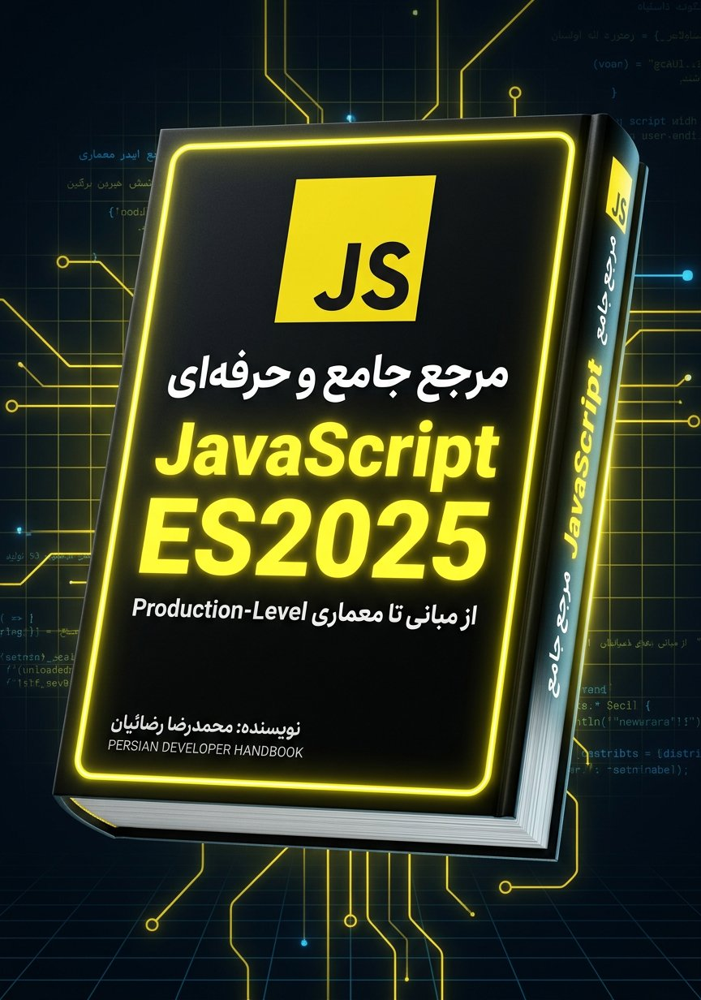
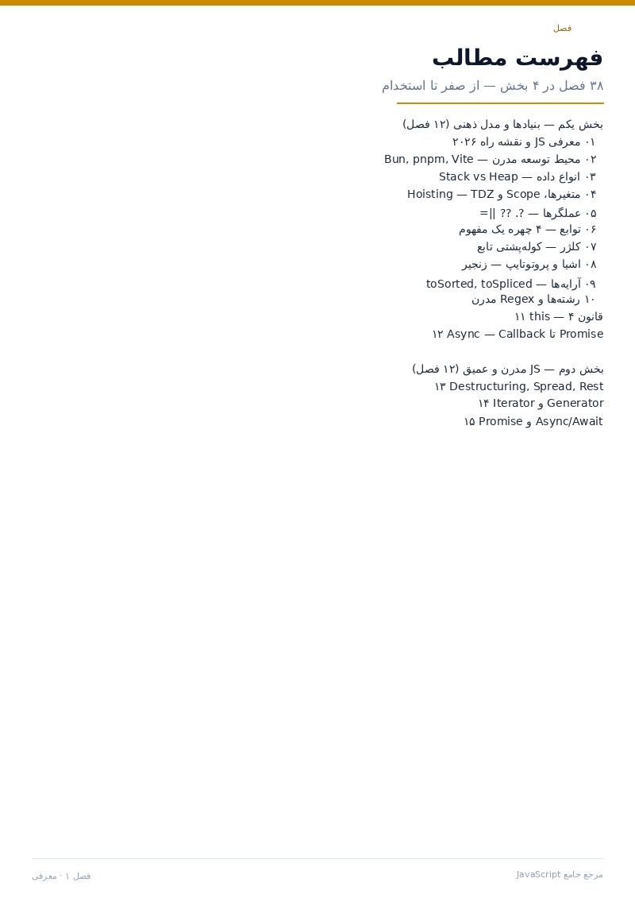
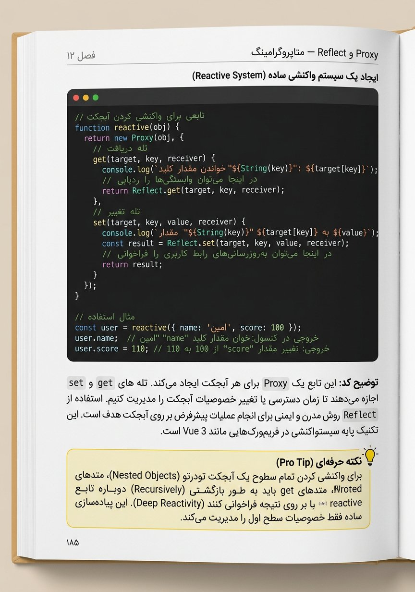
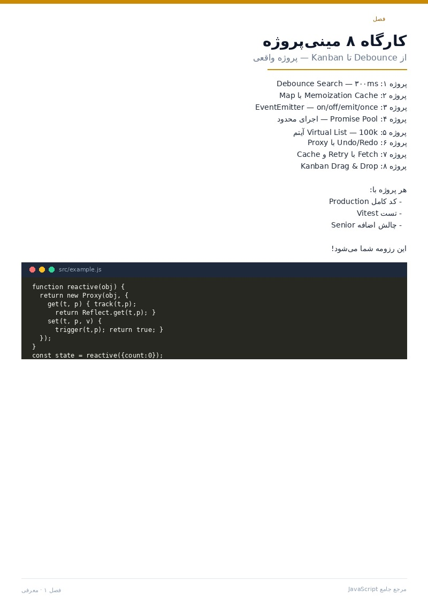

<a id="top"></a>

<p align="center">
  
</p>

<p align="center" dir="rtl">
  <strong>یک مسیر ساختاریافته برای فهم عمیق JavaScript مدرن</strong>
  <br>
  از مدل ذهنی زبان و قابلیت‌های ES2025 تا تست، امنیت، عملکرد و معماری نرم‌افزار
</p>

<p align="center">
  <a href="https://rezaian-dev.github.io/javascript-persian-guide/"></a>
  <a href="./docs/pdf/JavaScript-Persian-Guide.pdf"></a>
  <a href="./docs/pdf/JavaScript-Persian-Guide.epub"></a>
</p>

<p align="center">
  
  
  
  
  
</p>

<p align="center" dir="rtl">
  <a href="#about">درباره راهنما</a> ·
  <a href="#roadmap">مسیر یادگیری</a> ·
  <a href="#chapters">فهرست فصل‌ها</a> ·
  <a href="#preview">پیش‌نمایش</a> ·
  <a href="#build">ساخت از سورس</a> ·
  <a href="#contributing">مشارکت</a>
</p>

---

<div dir="rtl">

<a id="about"></a>

## درباره راهنما

این مخزن نسخه فارسی، پروژه‌محور و قابل ساختِ یک راهنمای جامع JavaScript است. محتوای آن در ۳۸ فصل از مبانی زبان آغاز می‌شود، به قابلیت‌های مدرن و سازوکارهای داخلی می‌رسد و با موضوعات موردنیاز توسعه نرم‌افزار در محیط Production کامل می‌شود.

تمرکز کتاب بر **درک رفتار زبان** است؛ یعنی به‌جای حفظ‌کردن APIها، یاد می‌گیرید چرا کد به شکل مشخصی اجرا می‌شود، چگونه خطاها را تحلیل کنید و برای تصمیم‌های فنی خود استدلال داشته باشید.

### ویژگی‌های راهنما

- **مفهوم‌محور:** هر موضوع با چرایی و مدل ذهنی آن توضیح داده می‌شود، نه صرفاً با فهرستی از APIها.
- **مرحله‌بندی‌شده:** فصل‌ها از مبانی به مباحث پیشرفته می‌رسند و برای مطالعه پیوسته طراحی شده‌اند.
- **کاربردی:** مثال‌های کد، تمرین‌ها و مینی‌پروژه‌ها، مفاهیم را به مسئله‌های واقعی متصل می‌کنند.
- **قابل استفاده در پروژه:** امنیت، تست، عملکرد و نگهداری‌پذیری در کنار قابلیت‌های زبان بررسی می‌شوند.
- **چندقالبی:** نسخه وب، PDF و EPUB برای شیوه‌های مختلف مطالعه در دسترس است.

<a id="roadmap"></a>

## مسیر یادگیری

| مرحله | فصل‌ها | تمرکز | نتیجه |
| --- | :---: | --- | --- |
| بنیادها | ۱ تا ۱۲ | زبان، Scope، توابع، Closure، اشیا، Prototype و Async | توانایی پیش‌بینی و تحلیل رفتار کد |
| JavaScript مدرن | ۱۳ تا ۲۴ | Promise، Event Loop، ESM، الگوهای تابعی، DOM و APIهای مرورگر | تسلط بر توسعه مدرن در مرورگر و Node.js |
| سطح Production | ۲۵ تا ۳۲ | Performance، V8، حافظه، امنیت، تست، ابزارها و معماری | طراحی کد پایدار، امن و قابل نگهداری |
| تمرین و آمادگی شغلی | ۳۳ تا ۳۸ | پروژه، خطاهای رایج، مصاحبه، واژه‌نامه و نقشه راه | تثبیت آموخته‌ها و آمادگی برای پروژه واقعی |

> اگر تازه شروع کرده‌اید، فصل‌ها را به‌ترتیب بخوانید. اگر تجربه عملی دارید، می‌توانید مستقیماً از مرحله متناسب با نیاز خود وارد شوید.

<a id="chapters"></a>

## فهرست فصل‌ها

<details>
<summary><strong>بخش اول — بنیادها و مدل ذهنی (فصل‌های ۱ تا ۱۲)</strong></summary>

1. [معرفی JavaScript و نقشه راه](./src/chapters/01-intro.md)
2. [محیط توسعه مدرن](./src/chapters/02-setup.md)
3. [انواع داده و سیستم نوع](./src/chapters/03-types-values.md)
4. [متغیرها، Scope و Hoisting](./src/chapters/04-variables-scope.md)
5. [عملگرها و کنترل جریان](./src/chapters/05-operators-control.md)
6. [توابع](./src/chapters/06-functions.md)
7. [Closure و زنجیره Scope](./src/chapters/07-closures-scope-chain.md)
8. [اشیا و Prototype](./src/chapters/08-objects-prototypes.md)
9. [آرایه‌ها](./src/chapters/09-arrays.md)
10. [رشته‌ها و Regular Expression](./src/chapters/10-strings-regex.md)
11. [`this` و قواعد Binding](./src/chapters/11-this-binding.md)
12. [مقدمه برنامه‌نویسی ناهمگام](./src/chapters/12-async-intro.md)

</details>

<details>
<summary><strong>بخش دوم — JavaScript مدرن و عمیق (فصل‌های ۱۳ تا ۲۴)</strong></summary>

13. [Destructuring، Spread و Rest](./src/chapters/13-destructuring-spread.md)
14. [Iterator و Generator](./src/chapters/14-iterators-generators.md)
15. [Promise پیشرفته و Async/Await](./src/chapters/15-promise-async-await.md)
16. [Event Loop و مدل هم‌زمانی](./src/chapters/16-event-loop-concurrency.md)
17. [ماژول‌های ESM و CommonJS](./src/chapters/17-modules-esm-cjs.md)
18. [کلاس‌ها و OOP](./src/chapters/18-classes-oop.md)
19. [مدیریت خطا](./src/chapters/19-error-handling.md)
20. [Map، Set و کالکشن‌های پیشرفته](./src/chapters/20-collections-map-set.md)
21. [Proxy و Reflect](./src/chapters/21-proxy-reflect.md)
22. [برنامه‌نویسی تابعی](./src/chapters/22-functional-programming.md)
23. [DOM و BOM](./src/chapters/23-dom-bom.md)
24. [Fetch، Storage و APIهای مرورگر](./src/chapters/24-fetch-api-storage.md)

</details>

<details>
<summary><strong>بخش سوم — مهندسی و Production (فصل‌های ۲۵ تا ۳۲)</strong></summary>

25. [Performance و بهینه‌سازی](./src/chapters/25-performance-optimization.md)
26. [حافظه و Garbage Collection](./src/chapters/26-memory-gc.md)
27. [امنیت در JavaScript](./src/chapters/27-security.md)
28. [تست‌نویسی مدرن](./src/chapters/28-testing.md)
29. [ابزارها و Bundlerها](./src/chapters/29-tooling-bundlers.md)
30. [TypeScript و تعامل با JavaScript](./src/chapters/30-typescript-interop.md)
31. [الگوها و معماری تمیز](./src/chapters/31-patterns-architecture.md)
32. [متاپروگرامینگ پیشرفته](./src/chapters/32-meta-programming.md)

</details>

<details>
<summary><strong>بخش چهارم — تمرین و آمادگی شغلی (فصل‌های ۳۳ تا ۳۸)</strong></summary>

33. [۳۰ نکته و ترفند کاربردی](./src/chapters/33-tips-tricks.md)
34. [کارگاه ۸ مینی‌پروژه](./src/chapters/34-workshop.md)
35. [۲۰ اشتباه رایج و راه‌حل آن‌ها](./src/chapters/35-mistakes.md)
36. [۵۰ پرسش مصاحبه از Junior تا Senior](./src/chapters/36-interview.md)
37. [واژه‌نامه فارسی–انگلیسی](./src/chapters/37-glossary.md)
38. [نقشه راه بعد از کتاب](./src/chapters/38-roadmap-next.md)

</details>

<a id="preview"></a>

## پیش‌نمایش

<p align="center">
  
  
  
  
</p>

<a id="build"></a>

## ساخت از سورس

### پیش‌نیازها

- Python 3.10 یا جدیدتر
- وابستگی‌های سیستمی موردنیاز [WeasyPrint](https://doc.courtbouillon.org/weasyprint/stable/first_steps.html#installation)

### راه‌اندازی محیط

```bash
git clone https://github.com/rezaian-dev/javascript-persian-guide.git
cd javascript-persian-guide

python -m venv .venv
source .venv/bin/activate       # macOS / Linux
# .venv\Scripts\Activate.ps1   # Windows PowerShell

python -m pip install --upgrade pip
pip install -r src/requirements.txt
```

### تولید خروجی

```bash
python src/build.py --html      # src/build/book.html
python src/build.py             # docs/pdf/JavaScript-Persian-Guide.pdf
python src/build.py --print     # نسخه مناسب چاپ
```

فونت‌های موردنیاز پروژه در `src/fonts` قرار دارند و هنگام ساخت خروجی به‌صورت محلی استفاده می‌شوند.

## ساختار مخزن

```text
.
├── README.md
├── LICENSE
├── docs/
│   ├── assets/                 # تصاویر و پیش‌نمایش‌ها
│   ├── pdf/                    # خروجی‌های PDF و EPUB
│   └── index.html              # وب‌سایت پروژه
└── src/
    ├── banner/                 # تصاویر بنر
    ├── chapters/               # متن فصل‌ها
    ├── fonts/                  # فونت‌های محلی
    ├── build.py                # سازنده HTML و PDF
    ├── build_epub.py           # سازنده EPUB
    ├── style.css               # استایل نسخه دیجیتال
    └── style-print.css         # استایل نسخه چاپی
```

<a id="contributing"></a>

## مشارکت

گزارش خطا، اصلاح محتوا و پیشنهاد برای فصل‌های جدید از طریق [Issues](https://github.com/rezaian-dev/javascript-persian-guide/issues) و Pull Request پذیرفته می‌شود. برای ساده‌ترشدن بررسی، هر Pull Request را به یک تغییر مشخص محدود کنید و دلیل تغییر را شفاف بنویسید.

## نویسنده و نگهدارنده

**محمدرضا رضائیان** — [@rezaian-dev](https://github.com/rezaian-dev)

## مجوز

این اثر با مجوز [Creative Commons BY-NC-SA 4.0](./LICENSE) منتشر شده است:

- استفاده و بازنشر غیرتجاری با ذکر منبع مجاز است.
- تغییر و اقتباس با حفظ همین مجوز مجاز است.
- استفاده تجاری بدون دریافت اجازه مجاز نیست.

</div>

---

<p align="center" dir="rtl">
  اگر این راهنما برایتان مفید بود، با ثبت یک ⭐ از ادامه توسعه آن حمایت کنید.
  <br>
  <a href="#top">بازگشت به بالا</a>
</p>
