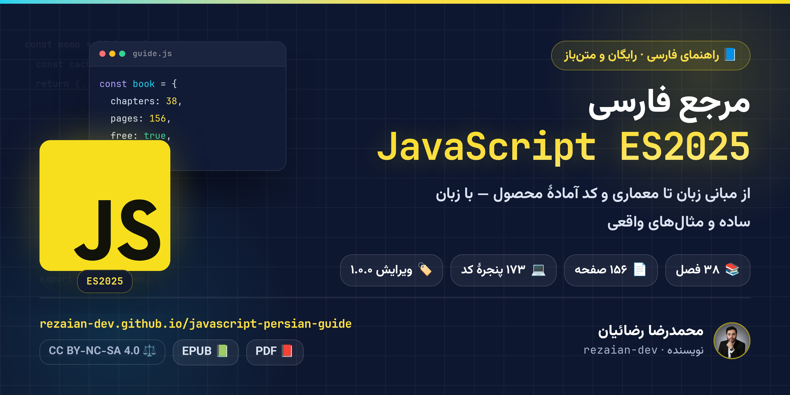

  

  <strong>🎉 مرجع فارسی JavaScript ES2025 — از مدل ذهنی تا معماری Production</strong> 
  ویرایش ۱٫۰٫۰ · ۲۰۲۶ · رایگان و متن‌باز

  
  
  

  
  
  
  
  

---

## ✨ این کتاب چیست؟

> **مرجع فارسی، پروژه‌محور و به‌روز JavaScript ES2025** — از مدل ذهنی زبان تا کد آمادهٔ Production.

جاوااسکریپت دنیای خودش را دارد: **Closure**، **Event Loop**، موتور **V8** و امکانات مدرن ES2025. این کتاب همان‌ها را — از صفر تا سطح ارشد — با **زبان ساده، مدل ذهنی درست و کد واقعی** توضیح می‌دهد.

اینجا قرار نیست فهرست متدها را حفظ کنید؛ قرار است یاد بگیرید مثل یک مهندس ارشد **رفتار زبان را پیش‌بینی کنید، باگ را ریشه‌یابی کنید و معماری تمیز بچینید**. 🧠

## 👥 برای چه کسی؟

| 🎯 اگر شما… | 📦 این کتاب به شما می‌دهد |
|:---:|:---|
| تازه وارد دنیای JS شده‌اید | مسیر یادگیری گام‌به‌گام از صفر تا درک عمیق زبان |
| با JS کار کرده‌اید ولی سطحی | مدل ذهنی موتور: Closure، this، Prototype و Event Loop |
| دنبال سطح ارشد هستید | V8، پرفورمنس، حافظه، امنیت، تست و معماری تمیز |
| در مسیر استخدام هستید | ۵۰ پرسش مصاحبه با پاسخ تشریحی و واژه‌نامهٔ تخصصی |

**🔎 پیش‌نیاز واقعی:** آشنایی اولیه با هر زبان برنامه‌نویسی کافی است؛ کتاب خودش از مبانی شروع می‌کند و به مبانی Node.js و ابزارهای مدرن هم اشاره می‌کند.

## 💎 چرا این کتاب متفاوت است؟

- 🧠 **تمرکز بر «چرا»** — درک رفتار موتور و Event Loop به‌جای حفظ‌کردن سینتکس
- 💻 **کد واقعی، نه اسلایدهای تئوری** — ۱۷۳ پنجرهٔ کد و ترمینال در سراسر کتاب
- 🛠️ **یادگیری با دست** — ۸ مینی‌پروژهٔ کارگاهی، از Debounce تا معماری ماژولار
- 🔐 **مهندسی از روز اول** — حافظه و GC، امنیت، تست، Tooling و الگوهای Production
- 🇮🇷 **فارسی روان، اصطلاح‌ها دوزبانه** — با واژه‌نامهٔ ۱۴۰ اصطلاح کلیدی در پایان کتاب

## 🖼️ نگاهی به داخل کتاب

  
  
  
  
  

💡 برای دیدن هر صفحه در اندازهٔ کامل، روی آن کلیک کنید.

## 📦 در چه قالبی؟

| قالب | مناسب برای | یادداشت | لینک |
|:---:|:---|:---|:---:|
| 🌐 **آنلاین** | مطالعهٔ فوری در مرورگر، بدون دانلود | تصویر صفحه‌های حروف‌چینی‌شده است؛ متن قابل انتخاب نیست و برای بزرگ‌نمایی، هر صفحه در اندازهٔ کامل باز می‌شود | [شروع مطالعه](https://rezaian-dev.github.io/javascript-persian-guide/book/) |
| 📕 **PDF** | دانلود، جست‌وجو و چاپ — قطع A4 رنگی | متن برداری و قابل انتخاب/جست‌وجوست | [دانلود](https://rezaian-dev.github.io/javascript-persian-guide/pdf/JavaScript-Persian-Guide.pdf) |
| 📗 **EPUB** | موبایل، تبلت و کتاب‌خوان | متن بازچینش‌پذیر راست‌به‌چپ | [دانلود](https://rezaian-dev.github.io/javascript-persian-guide/pdf/JavaScript-Persian-Guide.epub) |

⚠️ نسخهٔ آنلاین عکسِ صفحه‌های کتاب است؛ برای کپی‌کردن کد یا جست‌وجوی متن، از PDF یا EPUB استفاده کنید.

## 📚 فهرست کامل ۳۸ فصل

چهار بخش؛ هر بخش را جدا باز کنید:

<strong>🌱 بنیادها و مدل ذهنی</strong> · فصل‌های ۱ تا ۱۲

۱. [معرفی جاوااسکریپت و نقشه راه ۲۰۲۶ — از صفر تا بازار کار](https://rezaian-dev.github.io/javascript-persian-guide/book/#ch-01) — ص ۴
۲. [محیط توسعه مدرن — ستاپ حرفه‌ای ۲۰۲۶](https://rezaian-dev.github.io/javascript-persian-guide/book/#ch-02) — ص ۹
۳. [انواع داده و سیستم نوع — جایی که ۸۰٪ باگ‌ها متولد می‌شود](https://rezaian-dev.github.io/javascript-persian-guide/book/#ch-03) — ص ۱۵
۴. [متغیرها، Scope و Hoisting — از صفر تا TDZ و Lexical](https://rezaian-dev.github.io/javascript-persian-guide/book/#ch-04) — ص ۲۱
۵. [عملگرها و کنترل جریان — از if تا الگوهای مدرن ۲۰۲۵](https://rezaian-dev.github.io/javascript-persian-guide/book/#ch-05) — ص ۲۷
۶. [توابع — قلب جاوااسکریپت — ۴ چهره یک مفهوم](https://rezaian-dev.github.io/javascript-persian-guide/book/#ch-06) — ص ۳۲
۷. [کلژر و زنجیره Scope — مهم‌ترین مفهوم JS](https://rezaian-dev.github.io/javascript-persian-guide/book/#ch-07) — ص ۳۷
۸. [اشیا و پروتوتایپ — راز ارث‌بری JS](https://rezaian-dev.github.io/javascript-persian-guide/book/#ch-08) — ص ۴۲
۹. [آرایه‌ها — فراتر از لیست — شیء خاص با ترفندها](https://rezaian-dev.github.io/javascript-persian-guide/book/#ch-09) — ص ۴۶
۱۰. [رشته‌ها و Regex — از Template Literal تا Unicode](https://rezaian-dev.github.io/javascript-persian-guide/book/#ch-10) — ص ۵۱
۱۱. [this — راز بزرگ — با ۴ قانون حل می‌شود](https://rezaian-dev.github.io/javascript-persian-guide/book/#ch-11) — ص ۵۶
۱۲. [مقدمه Async — از Callback Hell تا Promise — چرا JS بلاک نمی‌شود](https://rezaian-dev.github.io/javascript-persian-guide/book/#ch-12) — ص ۶۲

<strong>🧩 JavaScript مدرن و عمیق</strong> · فصل‌های ۱۳ تا ۲۴

۱۳. [Destructuring، Spread و Rest](https://rezaian-dev.github.io/javascript-persian-guide/book/#ch-13) — ص ۶۷
۱۴. [Iterator و Generator](https://rezaian-dev.github.io/javascript-persian-guide/book/#ch-14) — ص ۷۰
۱۵. [Promise پیشرفته و Async/Await](https://rezaian-dev.github.io/javascript-persian-guide/book/#ch-15) — ص ۷۴
۱۶. [Event Loop و مدل همزمانی](https://rezaian-dev.github.io/javascript-persian-guide/book/#ch-16) — ص ۷۷
۱۷. [ماژول‌ها — ESM و CJS عمیق](https://rezaian-dev.github.io/javascript-persian-guide/book/#ch-17) — ص ۸۰
۱۸. [کلاس‌ها و OOP در JS](https://rezaian-dev.github.io/javascript-persian-guide/book/#ch-18) — ص ۸۳
۱۹. [مدیریت خطا — حرفه‌ای](https://rezaian-dev.github.io/javascript-persian-guide/book/#ch-19) — ص ۸۶
۲۰. [کالکشن‌های پیشرفته](https://rezaian-dev.github.io/javascript-persian-guide/book/#ch-20) — ص ۸۹
۲۱. [Proxy و Reflect — متاپروگرامینگ](https://rezaian-dev.github.io/javascript-persian-guide/book/#ch-21) — ص ۹۲
۲۲. [برنامه‌نویسی فانکشنال در JS](https://rezaian-dev.github.io/javascript-persian-guide/book/#ch-22) — ص ۹۵
۲۳. [DOM و BOM — جاوااسکریپت در مرورگر](https://rezaian-dev.github.io/javascript-persian-guide/book/#ch-23) — ص ۹۸
۲۴. [Fetch، Storage و APIهای مرورگر](https://rezaian-dev.github.io/javascript-persian-guide/book/#ch-24) — ص ۱۰۱

<strong>🏗️ مهندسی و Production</strong> · فصل‌های ۲۵ تا ۳۲

۲۵. [پرفورمنس و بهینه‌سازی](https://rezaian-dev.github.io/javascript-persian-guide/book/#ch-25) — ص ۱۰۴
۲۶. [حافظه و Garbage Collection](https://rezaian-dev.github.io/javascript-persian-guide/book/#ch-26) — ص ۱۰۷
۲۷. [امنیت در جاوااسکریپت](https://rezaian-dev.github.io/javascript-persian-guide/book/#ch-27) — ص ۱۱۰
۲۸. [تست‌نویسی مدرن](https://rezaian-dev.github.io/javascript-persian-guide/book/#ch-28) — ص ۱۱۳
۲۹. [ابزارها و باندلرها](https://rezaian-dev.github.io/javascript-persian-guide/book/#ch-29) — ص ۱۱۶
۳۰. [TypeScript و تعامل با JS](https://rezaian-dev.github.io/javascript-persian-guide/book/#ch-30) — ص ۱۱۹
۳۱. [الگوها و معماری تمیز](https://rezaian-dev.github.io/javascript-persian-guide/book/#ch-31) — ص ۱۲۲
۳۲. [متاپروگرامینگ پیشرفته](https://rezaian-dev.github.io/javascript-persian-guide/book/#ch-32) — ص ۱۲۶

<strong>🚀 کارگاه و آمادگی شغلی</strong> · فصل‌های ۳۳ تا ۳۸

۳۳. [۳۰ نکته و ترفند طلایی](https://rezaian-dev.github.io/javascript-persian-guide/book/#ch-33) — ص ۱۲۹
۳۴. [کارگاه ۸ مینی‌پروژه](https://rezaian-dev.github.io/javascript-persian-guide/book/#ch-34) — ص ۱۳۵
۳۵. [۲۰ اشتباه رایج و راه‌حل](https://rezaian-dev.github.io/javascript-persian-guide/book/#ch-35) — ص ۱۴۰
۳۶. [۵۰ پرسش مصاحبه — از Junior تا Senior](https://rezaian-dev.github.io/javascript-persian-guide/book/#ch-36) — ص ۱۴۴
۳۷. [واژه‌نامه فارسی-انگلیسی](https://rezaian-dev.github.io/javascript-persian-guide/book/#ch-37) — ص ۱۴۷
۳۸. [نقشه راه بعد از کتاب](https://rezaian-dev.github.io/javascript-persian-guide/book/#ch-38) — ص ۱۵۲

## 📖 چطور بخوانمش؟

⚡ نسخهٔ [آنلاین](https://rezaian-dev.github.io/javascript-persian-guide/book/) نیازی به نصب ندارد — همین حالا شروع کنید. سه مسیر پیشنهادی:

| مسیر | مناسب برای | پیشنهاد |
|:---:|:---:|:---|
| 📗 **مسیر کامل** | تازه‌واردها | از فصل ۱ شروع کنید؛ هر فصل روی فصل قبلی سوار می‌شود |
| ⚡ **مسیر موضوعی** | باتجربه‌ها | مستقیم سراغ Event Loop، ماژول‌ها، V8 و امنیت بروید |
| 🎯 **مسیر مصاحبه** | جویندگان کار | فصل‌های Closure و this و Event Loop + فصل ۳۶ و واژه‌نامه |

💡 هر فصل با مثال‌ها و جمع‌بندی خودش کامل است؛ می‌توانید از همان‌جایی که نیاز دارید شروع کنید.

## 🧩 مجموعهٔ راهنماهای فارسی

این کتاب بخشی از یک مجموعهٔ چهارگانه است:

| راهنما | موضوع | وضعیت |
|:---|:---:|:---:|
| 🌱 [Git و GitHub ۲۰۲۶](https://github.com/rezaian-dev/git-github-persian-guide) | نسخه‌بندی، VS Code و همکاری | ✅ منتشرشده |
| 🟨 **JavaScript ES2025** (همین کتاب) | زبان و مدل ذهنی | 📍 همین‌جا |
| ⚛️ [React 19](https://github.com/rezaian-dev/react-19-persian-guide) | رابط کاربری، state و معماری | ✅ منتشرشده |
| ▲ [Next.js 16](https://github.com/rezaian-dev/nextjs-16-persian-guide) | فریم‌ورک، رندر سرور و استقرار | ✅ منتشرشده |

## 🤝 بازخورد و مشارکت

غلط تایپی دیدید؟ 🙃 نکته‌ای نیاز به اصلاح یا توضیح بیشتر دارد؟ یک [Issue](https://github.com/rezaian-dev/javascript-persian-guide/issues) باز کنید — هر گزارش، نسخهٔ بعدی کتاب را بهتر می‌کند. 🙏

## ✍️ نویسنده و مجوز

**محمدرضا رضائیان** — [@rezaian-dev](https://github.com/rezaian-dev)

این اثر با مجوز <a href="https://creativecommons.org/licenses/by-nc-sa/4.0/" target="_blank" rel="noopener">Creative Commons BY-NC-SA 4.0</a> منتشر شده است: استفاده و بازنشر <strong>غیرتجاری</strong> با ذکر منبع آزاد است و نسخهٔ اقتباسی باید با همین مجوز منتشر شود. ⚖️

---

  ⭐ اگر این راهنما برایتان مفید بود، با ثبت یک ستاره از ادامهٔ راه مجموعه حمایت کنید.
   
  <a href="#top">بازگشت به بالا ↑</a>

