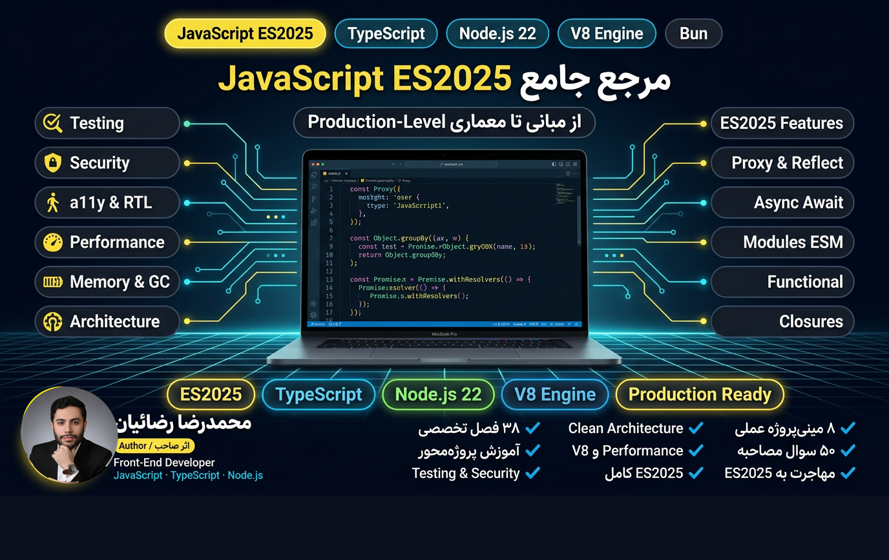

<div align="center">



<br>

راهنمای فارسی و پروژه‌محور **JavaScript مدرن**؛ از مفاهیم پایه و مدل ذهنی زبان تا معماری، امنیت، تست و بهینه‌سازی عملکرد.

<br>


</div>

---

<div dir="rtl">

## درباره راهنما

این پروژه یک مرجع ساختاریافته برای یادگیری عمیق JavaScript است. مطالب در ۳۸ فصل تنظیم شده‌اند و علاوه بر سینتکس زبان، موضوعاتی مانند Scope و Closure، مدل شیء و Prototype، برنامه‌نویسی ناهمگام، موتور V8، مدیریت حافظه، امنیت، تست‌نویسی، TypeScript و معماری نرم‌افزار را پوشش می‌دهند.

هدف راهنما این است که خواننده به‌جای حفظ‌کردن APIها، رفتار زبان را درک کند و بتواند از JavaScript در پروژه‌های واقعی با اطمینان بیشتری استفاده کند.

## مطالعه و دانلود

| نسخه | لینک | کاربرد |
| --- | --- | --- |
| وب | [مشاهده نسخه آنلاین](https://rezaian-dev.github.io/javascript-persian-guide/) | مطالعه در مرورگر |
| PDF | [دانلود JavaScript-Persian-Guide.pdf](./docs/pdf/JavaScript-Persian-Guide.pdf) | مطالعه آفلاین و چاپ |
| EPUB | [دانلود JavaScript-Persian-Guide.epub](./docs/pdf/JavaScript-Persian-Guide.epub) | موبایل و کتاب‌خوان |

## سرفصل‌ها

| بخش | فصل‌ها | موضوعات اصلی |
| --- | :---: | --- |
| بنیادها و مدل ذهنی | ۱–۱۲ | انواع داده، Scope، Hoisting، توابع، Closure، Prototype، `this` و مبانی Async |
| JavaScript مدرن | ۱۳–۲۴ | Destructuring، Iterator، Generator، Promise، Event Loop، ESM، Proxy، DOM و Fetch |
| مهندسی و Production | ۲۵–۳۲ | Performance، موتور V8، حافظه و GC، امنیت، تست، ابزارها، TypeScript و معماری تمیز |
| تمرین و آمادگی شغلی | ۳۳–۳۸ | نکات کاربردی، ۸ مینی‌پروژه، خطاهای رایج، پرسش‌های مصاحبه، واژه‌نامه و نقشه راه |

فایل‌های هر فصل در مسیر [`src/chapters`](./src/chapters/) قرار دارند.

## ساخت از سورس

### پیش‌نیازها

- Python 3.10 یا بالاتر
- وابستگی‌های سیستمی موردنیاز [WeasyPrint](https://doc.courtbouillon.org/weasyprint/stable/first_steps.html#installation)

### نصب و اجرا

```bash
git clone https://github.com/rezaian-dev/javascript-persian-guide.git
cd javascript-persian-guide

python -m venv .venv
source .venv/bin/activate       # Windows: .venv\Scripts\activate
pip install -r src/requirements.txt

python src/build.py --html      # پیش‌نمایش HTML
python src/build.py             # تولید PDF رنگی
python src/build.py --print     # تولید نسخه مناسب چاپ
```

خروجی HTML در `src/build/book.html` و PDF اصلی در `docs/pdf/JavaScript-Persian-Guide.pdf` ساخته می‌شود.

## ساختار مخزن

```text
.
├── README.md
├── docs/
│   ├── assets/                 # تصاویر و فایل‌های نمایشی
│   ├── pdf/                    # نسخه‌های PDF و EPUB
│   └── index.html              # وب‌سایت معرفی
└── src/
    ├── chapters/               # متن ۳۸ فصل
    ├── fonts/                  # فونت‌های موردنیاز خروجی
    ├── build.py                # سازنده HTML و PDF
    ├── build_epub.py           # سازنده EPUB
    └── style.css               # استایل نسخه کتاب
```

## مشارکت

برای گزارش خطا، پیشنهاد موضوع یا اصلاح محتوا، ابتدا یک [Issue](https://github.com/rezaian-dev/javascript-persian-guide/issues) ایجاد کنید. Pull Requestها بهتر است کوچک، متمرکز و همراه با توضیح روشن درباره تغییر باشند.

## نویسنده

**محمدرضا رضائیان** — [@rezaian-dev](https://github.com/rezaian-dev)

## مجوز

این اثر تحت مجوز [CC BY-NC-SA 4.0](./LICENSE) منتشر شده است. بازنشر و اقتباس غیرتجاری با ذکر منبع مجاز است و نسخه مشتق‌شده باید با همین مجوز منتشر شود.

</div>
